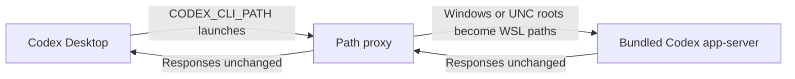

# Codex Desktop WSL project-path fix

An unofficial, temporary workaround for
[openai/codex#41290](https://github.com/openai/codex/issues/41290). Codex
Desktop can send Windows or UNC project roots to its Linux app-server unchanged,
which breaks project creation in WSL mode.

The proxy rewrites only project root paths and passes all other traffic through
unchanged.

## Install

Requirements: Codex Desktop on Windows using a WSL agent, with Python 3 inside
that WSL distribution.

1. Copy [`codex-app-server-proxy`](./codex-app-server-proxy) to a permanent
   Windows location visible to WSL, such as
   `C:\Users\<you>\CodexFixes\codex-app-server-proxy`.
2. Mark the copied file executable from WSL.
3. Create a Windows **user** environment variable named `CODEX_CLI_PATH` that
   points to the copied file.
4. Fully quit Codex, including the tray process, and reopen it.

Done. Create projects normally; there is no per-project step or background
service.

Alternatively, run [`install-fix.ps1`](./install-fix.ps1) from a normal Windows
PowerShell window to perform steps 1–3 automatically.

## Remove

Fully quit Codex and run [`remove-fix.ps1`](./remove-fix.ps1), or delete the
`CODEX_CLI_PATH` user variable and the copied proxy file. Codex will return to
its bundled CLI after reopening.

`CODEX_CLI_PATH` is an undocumented internal override, so remove this workaround
after Codex fixes the upstream bug. This workaround is for WSL agent mode only.
