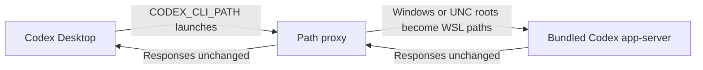

# Codex Desktop WSL fixes

Two independent, unofficial workarounds for Codex Desktop on Windows with the
agent running in WSL. Both keep the agent and your repositories in WSL. Install
the fix that matches your error, or use both.

| Fix | Symptom | Script |
| --- | --- | --- |
| [1. WSL project paths](#1-wsl-project-paths) | Creating or importing a project fails with `AbsolutePathBuf deserialized without a base path` | [`codex-app-server-proxy`](./codex-app-server-proxy) |
| [2. Computer Use from WSL](#2-computer-use-from-wsl) | Invalid WSL cwd, wrong Windows child executable, or unreliable Chrome capture immediately after input | [`node-repl-path-proxy.py`](./node-repl-path-proxy.py), optional [`fix-computer-use-chrome-timing.py`](./fix-computer-use-chrome-timing.py) |

These use internal launch settings or a guarded runtime edit and are temporary.
Remove a workaround once your installed Codex release fixes the corresponding
problem. This repository does not redistribute OpenAI executables or contain
user configuration.

The [Computer Use investigation](./docs/computer-use-investigation.md) records
the distinct failures, attempted repairs, live results, community sources, and
remaining verification work. The startup adapter and the Chrome timing patch
address different stages; install only the components matching your symptoms.

**Current limitation:** earlier native Chrome acceptance passed, but a later
dev product test switched to Playwright after native observations stopped
updating. The complete product flow through native Computer Use is still under
investigation. The timing patch is a candidate workaround, not a universal fix.
On October 3, a fresh normal Chrome launch still stopped at its first native
text capture after the bridge CLI was matched to the current app. Window
selection and activation succeeded. That capture began about 42 seconds after
launch, so a longer startup wait alone is not an established repair.
Later controls passed cold capture through both the diagnostic and native
launchers, with the accessibility flag absent, while reusing a helper session
after successful browser observations. Resetting only the JavaScript/helper
session reproduced the first-capture stop, even with activation and capture in
one call. Fresh-helper reliability remains unresolved; the passing controls do
not establish that the startup flag or a different launcher fixes it.

## 1. WSL project paths

An unofficial, temporary workaround for
[openai/codex#41290](https://github.com/openai/codex/issues/41290). Codex
Desktop can send Windows or UNC project roots to its Linux app-server unchanged,
which breaks project creation in WSL mode.

The proxy rewrites only project root paths and passes all other traffic through
unchanged.



### Install the project fix

Requirements: Codex Desktop on Windows using a WSL agent, with Python 3 inside
that WSL distribution.

1. Copy [`codex-app-server-proxy`](./codex-app-server-proxy) to a permanent
   Windows location visible to WSL, such as
   `C:\Users\<you>\CodexFixes\codex-app-server-proxy`.
2. Mark the copied file executable from WSL.
3. Create a Windows **user** environment variable named `CODEX_CLI_PATH` that
   points to the copied file.
4. Fully quit Codex, including the tray process, and reopen it.

Done. Create projects normally; there is no per-project step or background
service.

Alternatively, run [`install-fix.ps1`](./install-fix.ps1) from a normal Windows
PowerShell window to perform steps 1–3 automatically.

### Remove the project fix

Fully quit Codex and run [`remove-fix.ps1`](./remove-fix.ps1), or delete the
`CODEX_CLI_PATH` user variable and the copied proxy file. Codex will return to
its bundled CLI after reopening.

`CODEX_CLI_PATH` is an undocumented internal override, so remove this workaround
after Codex fixes the upstream bug. This workaround is for WSL agent mode only.

If both fixes are installed, remove the Computer Use configuration override
first; it can reference the project proxy in its child environment. Then remove
the project fix and reconfigure Computer Use only if the cwd error still occurs.

## 2. Computer Use from WSL

The Computer Use plugin launches a Windows `node_repl.exe` runtime. A WSL
working directory can arrive as a Linux file URI, for example:

```text
codex/sandbox-state-meta: sandboxCwd is not a local file URI:
file:///home/alice/dev/project
```

The adapter maps that URI to the **same directory** through `wslpath`, for
example `file://wsl.localhost/Ubuntu/home/alice/dev/project`. Windows-mounted
directories map to drive URIs such as `file:///C:/Users/alice/project`. It verifies
that the reverse mapping identifies the same directory. Missing directories,
symlinks, malformed URIs, and unsupported mappings stay unchanged.

When the project fix is also installed, the shared desktop Computer Use bridge
can inherit its WSL script as a Windows executable and fail with:

```text
failed to launch codex app-server:
%1 is not a valid Win32 application. (os error 193)
```

For that known selector, the adapter gives only the Windows child runtime a
locally copied, SHA-256-verified Windows bridge CLI and selects Sky's built-in
per-runtime connection with `SKY_CUA_NATIVE_PIPE=0`. The Codex agent still runs
in WSL; the Windows executable serves the Windows Computer Use bridge.

### Install the Computer Use fix

Requirements:

- Codex Desktop on Windows with the agent set to WSL2 and the Computer Use plugin
  installed.
- Python **3.11 or newer** inside the WSL distribution used by Codex.
- An existing `[mcp_servers.node_repl]` Windows runtime launch in the Codex
  `config.toml` used by that agent. The configuration helper preserves the runtime
  arguments and environment rather than guessing the plugin's trusted launch
  settings. It supports a direct `node_repl.exe` launch or this adapter's existing
  `python3 … node-repl-path-proxy.py -- … node_repl.exe` launch.

Run the configuration helper from this checkout in a **WSL terminal**. Replace
`<you>` with your Windows username, and point `--config` at the actual config
used by Codex; an independent WSL CLI can use a different Codex home.

```bash
python3 -B configure-computer-use-fix.py install \
  --config '/mnt/c/Users/<you>/.codex/config.toml' \
  --install-dir '/mnt/c/Users/<you>/CodexFixes/computer-use'
```

If the project fix is installed, include its path so the helper configures the
Windows bridge as well:

```bash
python3 -B configure-computer-use-fix.py install \
  --config '/mnt/c/Users/<you>/.codex/config.toml' \
  --install-dir '/mnt/c/Users/<you>/CodexFixes/computer-use' \
  --wsl-proxy '/mnt/c/Users/<you>/CodexFixes/codex-app-server-proxy'
```

These commands are **dry runs**. Review the paths, then fully quit Codex,
including its tray process, and run the same command from a separate WSL
terminal with `--apply` appended. The helper refuses writes while Codex is open.
Reopen Codex with its WSL agent and start a new Computer Use task.

The helper backs up `config.toml` and existing adapter settings, copies the
adapter to the permanent directory, and wraps only the `node_repl` launch. With
`--wsl-proxy`, it verifies the project proxy's ownership marker and scopes a
matching `CODEX_CLI_PATH` to the node runtime. An unrelated existing selector is
never replaced. The native bridge executable is discovered from the installed
`OpenAI.Codex` Windows package and copied locally; `--native-cli PATH` can select
that installed executable explicitly when package discovery is unavailable.

If no existing node runtime configuration is present, the helper stops without
writing. This is a compatibility adapter for an established runtime launch;
it does not generate the plugin's environment or install the plugin. Use
`--help` for all options.

### Permissions and validation

**Select Full Access in the chat that will use Computer Use.** Each chat can
have a different permission mode. The currently supported mode produces
`{"type":"disabled"}` in the tool metadata; the adapter does not select that
mode for you. Full Access relaxes the filesystem and network sandbox, while app
consent and browser policy checks still apply.

The cwd rewrite applies only when the incoming permission profile is exactly
`{"type":"disabled"}`. Restricted, unknown, or extended profiles pass through
unchanged. The adapter does not change that profile, switch sandbox modes, add
app approvals, or change browser policy. Restricted WSL profiles are unsupported:
Windows sandbox ACL setup failed on the WSL UNC workspace during testing, even
after its permission paths were translated.

#### Refresh a stale permissions connection

If you selected Full Access and the tool still fails on a Linux workspace or
permission path, its existing MCP connection may still carry the old restricted
profile. This was observed in an existing chat on **2026-10-01**: the chat's turn
had Full Access, but the tool received `type=managed`. Resetting the JavaScript
session did not refresh it. Reloading the app-server's MCP connections made the
tool receive the selected `type=disabled` profile and restored app enumeration.

Keep Codex open, let active tool calls finish, and preview the separate refresh
helper from a **WSL terminal**:

```bash
python3 -B refresh-computer-use.py \
  --adapter '/mnt/c/Users/<you>/CodexFixes/computer-use/node-repl-path-proxy.py'
```

Use the actual installed adapter path. Add `--apply` to send the reload request.
If more than one matching WSL app-server is running, select its PID with
`--server-pid`. The helper checks the adapter's parent process, bundled Linux
executable, process start time, and stdio pipe before writing the request.

This refreshes the MCP connections for that app-server through
`config/mcpServer/reload`; it can reinitialize other connected tools as well.
It does not restart Codex or change the engine, chat permissions, app approvals,
or browser URL checks. A reported reload request is not proof of working browser
input: retry in the affected chat and verify typing, navigation, and clicking.

#### Live browser results

The investigation separated successful startup/capture from verified browser
input. All browser tests used the native `@oai/sky` API with the WSL agent.

| Test stage | Observed result |
| --- | --- |
| WSL startup repair, September 30–October 1 | Correct cwd accepted, Sky imported, apps enumerated; later browser URL failures remained separate |
| Brave | Native captures and some early clicks worked; later input stopped at URL confidence. Reliable Brave control remains unverified |
| Chrome on loaded pages | Typing, committed Example Domain navigation, and the Learn more click to IANA passed in both chats; three complete affected-chat tests passed |
| Immediate state read after Chrome tab creation | Ctrl+T and Alt+Enter returned, but immediate native capture stopped at URL verification; foreground activation alone was insufficient |
| Forced complete Chrome accessibility | Initial New Tab capture/navigation passed, click was interrupted by physical Escape; fresh-turn repeat failed. This launcher is not a verified fix |
| Installed Chrome timing helper, October 2 | Four complete affected-chat tests passed, including normal native launch and its repeat without the experimental flag; see below |

The [investigation ledger](./docs/computer-use-investigation.md) records each
failure, attempted solution, primary community source, and verified result.

#### Chrome capture timing patch

When Chrome works on a loaded page but `get_window_state` stops immediately
after `Ctrl+T` with the URL-confidence error, the separate
[`fix-computer-use-chrome-timing.py`](./fix-computer-use-chrome-timing.py) adds
a short settling interval to the imported Sky API. The startup adapter alone
does not repair this transition.

The helper waits until two seconds have elapsed after successful ordinary Chrome
input or activation. Navigation-capable input (clicks, secondary actions, Enter,
Reload and Back/Forward shortcuts) receives five seconds before the original
native capture is called once. Time already
elapsed counts toward that interval. Other apps and other windows are unchanged.
All original native requests, URL verification, returned state, errors, and
physical Escape handling remain in place. It does not retry a native stop or
replace Computer Use with a browser controller.

Two diagnostic tests with a wait before the first capture passed the full
new-tab, typing, navigation, and link-click flow. The installed helper then
passed the same flow in two consecutive fresh turns without any explicit wait
in the affected chat. Immediate Ctrl+T captures took 2,162 ms and 2,135 ms,
each with a zero-millisecond gap before the capture call. A normal native Chrome
cold launch then passed the full flow, with the real Windows main process
confirmed to have no forced accessibility flag. That complete flow and its
fresh-turn repeat passed; immediate New Tab captures took 2,182 ms and 2,184 ms.
Both verified typing, committed navigation, and the Learn more click to IANA,
with matching screenshots, accessibility text, and native document URLs.
There were no native errors, manual waits, or kernel resets between these tests.
These are results for the earlier two-second revision. A later native dev-site
redirect failed at capture with that revision even though navigation occurred.
A five-second pre-capture diagnostic passed; the revised helper implements that
longer interval for navigation-capable input. Confidence is **medium-low** in the
revised candidate until independent native product acceptance is complete.
It does not resolve the observed first text-capture failure after a fresh launch.
The internal URL-resolution cause remains unproven.
The revised helper also passed a complete public-page flow on October 3 in an
existing helper session. A subsequent clean-helper cold test still stopped at
native URL confidence. These tests establish the reported outcomes, not native
product acceptance or reliable first use after a reset.

The earlier October 2 independent acceptance run in the affected WSL chat passed **all 11
criteria**, including Back and Reload, with zero native errors. Its first
post-Ctrl+T capture took 2,181 ms with no caller delay. The
[acceptance review](./docs/computer-use-investigation.md#independent-acceptance-review)
records the timings, observed URLs, and the Back text-field limitation.

Requirements: Python 3.11 or newer, the two script files from this checkout,
and the reviewed **Sky 0.7.5** runtime. This is a version-specific vendor-module
patch. It requires the original `sky.js` SHA-256
`0123da875a2eef5648fac407fcfedad5147ef9a1616b623ad615f4c337aee285`
and refuses other builds or conflicting later edits.

Let Computer Use tasks finish before applying or restoring the patch. From a
**WSL terminal**, preview it with the actual Sky package used by the affected
chat; replace `<you>` and `<runtime-id>` with its installed paths:

```bash
python3 -B fix-computer-use-chrome-timing.py \
  --sky-package '/mnt/c/Users/<you>/AppData/Local/OpenAI/Codex/runtimes/cua_node/<runtime-id>/bin/node_modules/@oai/sky'
```

The default is a dry run. Append `--apply` to install. Keep
[`chrome-action-settler.mjs`](./chrome-action-settler.mjs) beside the Python
script. The installer saves the original facade, copies the settling module,
and hooks only the Windows target. It leaves the native backend executable,
Chrome profile, Codex engine, and chat permissions untouched.

After installation, reset the **idle JavaScript session in each affected chat**
once before importing `@oai/sky` or making browser calls. Reloading the MCP
connection alone did not refresh the cached module in our test. Check that the
new import has the active wrapper before using it:

```js
globalThis.sky = (await import('@oai/sky')).sky;
nodeRepl.write(JSON.stringify({
  target: sky.target,
  settlingActive: Object.getOwnPropertyDescriptor(sky, 'get_window_state')
    .value.toString().includes('deadlines'),
}));
```

Then verify typing, committed navigation, and a visible link click through
ordinary Sky calls, including an immediate capture after creating a new tab.
A kernel reset is a module-loading step before a new test; do not use it to
continue Computer Use after a native stop in the same turn.

To remove the timing patch, run the same command with `--restore`, then reset
the idle JavaScript session before importing Sky. Restore preserves the backup
and refuses to overwrite a later vendor update or modified shim. Runtime paths
can change after Codex updates; an unsupported-build result means this reviewed
patch does not apply, not that its hash guard should be removed.
An app update replaced our runtime cache and removed the installed patch.
Check the actual current runtime and wrapper after updates, then rerun the
guarded installer only for a supported build. Updating this checkout also
supports upgrading the exact previously published two-second shim with
`--apply`; conflicting user edits are preserved.

#### Native Chrome workflow

Keep WSL selected and use the actual Computer Use `@oai/sky` API through Codex's
JavaScript tool. Start with an active, unlocked Windows desktop and Chrome on a
loaded public HTTPS page. In the affected chat, select a fresh returned Chrome
window, explicitly activate it, and confirm the screenshot and accessibility
text describe that window before entering text. Use the existing tab for the
initial test.

Verify address-field focus before typing, commit navigation, and verify both
the document URL and page content. After each input, obtain fresh state; a normal
loading snapshot may need another read-only observation before the next action.
Verify a visible link click by reading its destination. Preserve each API's
original error and record whether input returned before its refresh failed.
After Back, `document_text` contained only the URL in the acceptance test;
the native document URL, accessibility tree, and screenshot still verified
the correct page. Use those returned sources to corroborate page content.
If Computer Use ends the turn, stop input immediately. Do not use another
controller, change policy, or reset a session to conceal that stop.

**Successful startup and screen capture do not establish working browser input.**
Chrome input has worked in live tests in both chats. The initial three complete
tests in the affected chat used loaded pages or a previously opened New Tab.
The separate timing patch has repeated complete installed tests, including the
formerly failing immediate capture after tab creation, and a normal native cold
launch test and its fresh-turn repeat without the experimental flag. Those are
historical passes; the later clean-helper failure and native product test remain
unresolved. Neither component bypasses the URL check. Brave remains unverified;
Chrome is the tested browser.

During the same testing, Desktop also explicitly disabled its built-in Browser
Use and external Chrome/Brave browser integration when the agent runs in WSL. Its
availability log reports `reason=wsl-disabled`, while the settings UI can show
the generic organization/region availability message. Installing a browser
extension or enabling full CDP access does not remove that WSL check. This is a
separate finding from the native Computer Use URL-check failure, whose cause
has not been established. The adapter repairs startup compatibility only.

App consent and browser policy checks still apply. See the official
[Computer Use documentation](https://learn.chatgpt.com/docs/computer-use) and
[WSL documentation](https://learn.chatgpt.com/docs/windows/wsl) for the underlying
setup. Runtime and package paths can change after updates; review the installed
node launch and repeat the dry run. The helper refuses missing runtime paths or
conflicting later edits instead of silently changing them.

### Remove the Computer Use fix

If you installed the optional Chrome timing patch, restore it first using its
`--restore` command above.

From a **WSL terminal**, preview removal with the same config and directory:

```bash
python3 -B configure-computer-use-fix.py remove \
  --config '/mnt/c/Users/<you>/.codex/config.toml' \
  --install-dir '/mnt/c/Users/<you>/CodexFixes/computer-use'
```

Fully quit Codex and repeat with `--apply`. This restores the original node
runtime launch while keeping unrelated later config edits and the separate
project fix. It refuses to overwrite a node launch edited since installation.
Inactive adapter/native files and backups remain in the install directory for
recovery and can be deleted manually after verifying removal. Treat configuration
backups as private; they can contain your runtime environment.

## Tests

From the repository root in WSL, run:

```bash
python3 -B -m unittest discover -s tests -v
```

The tests cover project paths, directory identity, URI encoding, permission
preservation, native bridge verification, unchanged JSONL transport, dry runs,
the Desktop shutdown guard, installation, repeat installation, removal, and
selection of the running WSL app-server for a permissions connection refresh,
and guarded Chrome timing installation and restoration. Test the settling
module separately with a current Node.js runtime:

```bash
node --test tests/test_chrome_settler.mjs
```

These tests verify delay scope, native request/result preservation, and unchanged
error propagation without browser input. Mocked tests do not establish full
browser automation support; the live evidence is recorded separately.
