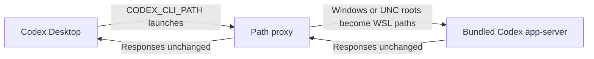

# Codex Desktop WSL fixes

Two independent, unofficial workarounds for Codex Desktop on Windows with the
agent running in WSL. Both keep the agent and your repositories in WSL. Install
the fix that matches your error, or use both.

| Fix | Symptom | Script |
| --- | --- | --- |
| [1. WSL project paths](#1-wsl-project-paths) | Creating or importing a project fails with `AbsolutePathBuf deserialized without a base path` | [`codex-app-server-proxy`](./codex-app-server-proxy) |
| [2. Computer Use from WSL](#2-computer-use-from-wsl) | Computer Use fails with `sandboxCwd is not a local file URI`, or its Windows bridge tries to execute the WSL project proxy | [`node-repl-path-proxy.py`](./node-repl-path-proxy.py) |

These use internal launch settings and are temporary. Remove a workaround once
your installed Codex release fixes the corresponding problem. This repository
does not redistribute OpenAI executables or contain user configuration.

## 1. WSL project paths

An unofficial, temporary workaround for
[openai/codex#41290](https://github.com/openai/codex/issues/41290). Codex
Desktop can send Windows or UNC project roots to its Linux app-server unchanged,
which breaks project creation in WSL mode.

The proxy rewrites only project root paths and passes all other traffic through
unchanged.



### Install the project fix

Requirements: Codex Desktop on Windows using a WSL agent, with Python 3 inside
that WSL distribution.

1. Copy [`codex-app-server-proxy`](./codex-app-server-proxy) to a permanent
   Windows location visible to WSL, such as
   `C:\Users\<you>\CodexFixes\codex-app-server-proxy`.
2. Mark the copied file executable from WSL.
3. Create a Windows **user** environment variable named `CODEX_CLI_PATH` that
   points to the copied file.
4. Fully quit Codex, including the tray process, and reopen it.

Done. Create projects normally; there is no per-project step or background
service.

Alternatively, run [`install-fix.ps1`](./install-fix.ps1) from a normal Windows
PowerShell window to perform steps 1–3 automatically.

### Remove the project fix

Fully quit Codex and run [`remove-fix.ps1`](./remove-fix.ps1), or delete the
`CODEX_CLI_PATH` user variable and the copied proxy file. Codex will return to
its bundled CLI after reopening.

`CODEX_CLI_PATH` is an undocumented internal override, so remove this workaround
after Codex fixes the upstream bug. This workaround is for WSL agent mode only.

If both fixes are installed, remove the Computer Use configuration override
first; it can reference the project proxy in its child environment. Then remove
the project fix and reconfigure Computer Use only if the cwd error still occurs.

## 2. Computer Use from WSL

The Computer Use plugin launches a Windows `node_repl.exe` runtime. A WSL
working directory can arrive as a Linux file URI, for example:

```text
codex/sandbox-state-meta: sandboxCwd is not a local file URI:
file:///home/alice/dev/project
```

The adapter maps that URI to the **same directory** through `wslpath`, for
example `file://wsl.localhost/Ubuntu/home/alice/dev/project`. Windows-mounted
directories map to drive URIs such as `file:///C:/Users/alice/project`. It verifies
that the reverse mapping identifies the same directory. Missing directories,
symlinks, malformed URIs, and unsupported mappings stay unchanged.

When the project fix is also installed, the shared desktop Computer Use bridge
can inherit its WSL script as a Windows executable and fail with:

```text
failed to launch codex app-server:
%1 is not a valid Win32 application. (os error 193)
```

For that known selector, the adapter gives only the Windows child runtime a
locally copied, SHA-256-verified Windows bridge CLI and selects Sky's built-in
per-runtime connection with `SKY_CUA_NATIVE_PIPE=0`. The Codex agent still runs
in WSL; the Windows executable serves the Windows Computer Use bridge.

### Install the Computer Use fix

Requirements:

- Codex Desktop on Windows with the agent set to WSL2 and the Computer Use plugin
  installed.
- Python **3.11 or newer** inside the WSL distribution used by Codex.
- An existing `[mcp_servers.node_repl]` Windows runtime launch in the Codex
  `config.toml` used by that agent. The configuration helper preserves the runtime
  arguments and environment rather than guessing the plugin's trusted launch
  settings. It supports a direct `node_repl.exe` launch or this adapter's existing
  `python3 … node-repl-path-proxy.py -- … node_repl.exe` launch.

Run the configuration helper from this checkout in a **WSL terminal**. Replace
`<you>` with your Windows username, and point `--config` at the actual config
used by Codex; an independent WSL CLI can use a different Codex home.

```bash
python3 -B configure-computer-use-fix.py install \
  --config '/mnt/c/Users/<you>/.codex/config.toml' \
  --install-dir '/mnt/c/Users/<you>/CodexFixes/computer-use'
```

If the project fix is installed, include its path so the helper configures the
Windows bridge as well:

```bash
python3 -B configure-computer-use-fix.py install \
  --config '/mnt/c/Users/<you>/.codex/config.toml' \
  --install-dir '/mnt/c/Users/<you>/CodexFixes/computer-use' \
  --wsl-proxy '/mnt/c/Users/<you>/CodexFixes/codex-app-server-proxy'
```

These commands are **dry runs**. Review the paths, then fully quit Codex,
including its tray process, and run the same command from a separate WSL
terminal with `--apply` appended. The helper refuses writes while Codex is open.
Reopen Codex with its WSL agent and start a new Computer Use task.

The helper backs up `config.toml` and existing adapter settings, copies the
adapter to the permanent directory, and wraps only the `node_repl` launch. With
`--wsl-proxy`, it verifies the project proxy's ownership marker and scopes a
matching `CODEX_CLI_PATH` to the node runtime. An unrelated existing selector is
never replaced. The native bridge executable is discovered from the installed
`OpenAI.Codex` Windows package and copied locally; `--native-cli PATH` can select
that installed executable explicitly when package discovery is unavailable.

If no existing node runtime configuration is present, the helper stops without
writing. This is a compatibility adapter for an established runtime launch;
it does not generate the plugin's environment or install the plugin. Use
`--help` for all options.

### Permissions and validation

The cwd rewrite applies only when the incoming permission profile is exactly
`{"type":"disabled"}`. Restricted, unknown, or extended profiles pass through
unchanged. The adapter does not change that profile, switch sandbox modes, add
app approvals, or change browser policy. Use it only for a workflow that already
has this supported profile; other profiles are not validated by this workaround.

Observed on **2026-09-30** with Codex Desktop `26.928.1915.0`, Computer Use plugin
`26.928.20755`, and Ubuntu WSL2:

- The original WSL cwd was accepted and `@oai/sky` imported successfully.
- App enumeration returned 40 installed apps, including 8 running apps.
- Through the actual Codex Computer Use tool, Brave's GitHub window could be
  captured, its controls read, and a search field clicked.
- The later keyboard test stopped because Computer Use could not confidently
  determine the browser URL for its policy check. **This workaround does not fix
  that separate URL policy block; full Brave keyboard control remains unverified.**

App consent and browser policy checks still apply. See the official
[Computer Use documentation](https://learn.chatgpt.com/docs/computer-use) and
[WSL documentation](https://learn.chatgpt.com/docs/windows/wsl) for the underlying
setup. Runtime and package paths can change after updates; review the installed
node launch and repeat the dry run. The helper refuses missing runtime paths or
conflicting later edits instead of silently changing them.

### Remove the Computer Use fix

From a **WSL terminal**, preview removal with the same config and directory:

```bash
python3 -B configure-computer-use-fix.py remove \
  --config '/mnt/c/Users/<you>/.codex/config.toml' \
  --install-dir '/mnt/c/Users/<you>/CodexFixes/computer-use'
```

Fully quit Codex and repeat with `--apply`. This restores the original node
runtime launch while keeping unrelated later config edits and the separate
project fix. It refuses to overwrite a node launch edited since installation.
Inactive adapter/native files and backups remain in the install directory for
recovery and can be deleted manually after verifying removal. Treat configuration
backups as private; they can contain your runtime environment.

## Tests

From the repository root in WSL, run:

```bash
python3 -B -m unittest discover -s tests -v
```

The tests cover project paths, directory identity, URI encoding, permission
preservation, native bridge verification, unchanged JSONL transport, dry runs,
the Desktop shutdown guard, installation, repeat installation, and removal.
Mocked process/config tests do not establish full browser automation support.
