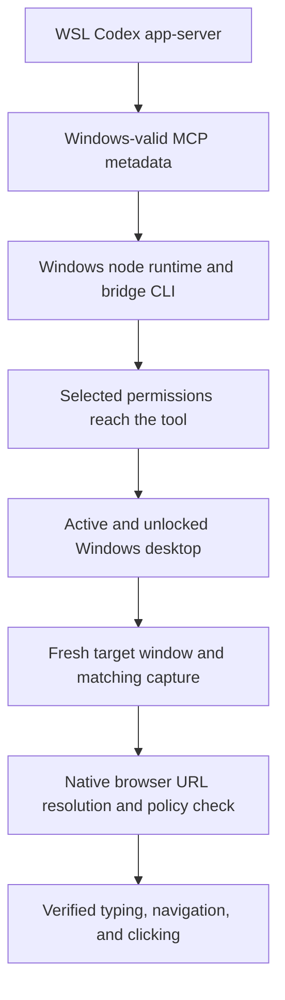

# Native Computer Use with a WSL agent: investigation

Updated: 2026-10-02. Status: **active; reliable browser control is not yet established**.

The goal is to operate Windows Chrome through Codex's bundled native Computer
Use API from an existing WSL-backed chat. The agent and repositories stay in
WSL. Completion requires verified typing, navigation, and mouse clicking in
that affected chat, followed by a successful test in another fresh turn.

## What the evidence currently establishes

The investigation has encountered several independent failures. Repairing an
earlier stage allows the next stage to run; it does not prove the later stage
works.



The URI and Windows-child launch repairs have cleared startup failures. Reloading
MCP connections cleared stale permissions in the affected chat. Chrome keyboard
and mouse navigation passed in the troubleshooting chat on October 1. In the
affected existing chat, opening a tab and typing passed, but the navigation step
ended with the native URL-confidence stop. Its page load and mouse control are
unverified.

On October 2, a later native inventory exposed no targetable Chrome window.
The supported native launch restored one New Tab window. A fresh read-only
baseline then returned from `get_window` but failed in `get_window_state` with
the same URL-confidence stop, before any keyboard or mouse input. This pins
down that attempt's failing API. An already-loaded public HTTPS baseline in the
affected chat is still pending; the New Tab result does not establish its result.

The exact unresolved error is:

```text
Computer Use has been stopped for this turn because it could not determine
the current browser URL on Windows with enough confidence to enforce policy.
Stop your work and send a final message noting why Computer Use ended.
```

That error reports unsuccessful URL verification. It does not identify which
internal stage failed or establish that the intended public site was denied.

## Issues and attempts recorded so far

The numbered evidence references below identify local diagnostic checkpoints.
They distinguish live native-tool results from isolated probes, unit tests, and
untested proposals. Private logs and configuration are not published here.

| Issue | What we tried | Observed result | Current conclusion / evidence |
| --- | --- | --- | --- |
| Project creation sends Windows/UNC roots to the WSL app-server | Separate project-root JSONL proxy | Existing project-path workaround published independently | Keep separate from Computer Use; see the main README |
| Windows `node_repl` rejects `file:///home/...` before JavaScript runs | Compare original URI with the same directory represented through WSL UNC | Original rejected; translated URI executed the isolated test | URI mismatch confirmed; checkpoints 1–3 |
| Initial adapter handled mounted Windows drives but missed Linux-native WSL directories | Add `wslpath` mapping and reverse directory-identity validation | Both drive and WSL mappings passed checks; native app enumeration subsequently worked | Startup repair works; checkpoints 2–5 |
| Windows bridge inherited the Linux project-proxy script as `CODEX_CLI_PATH` | Give only the Windows child a copied, verified Windows CLI; retain the WSL agent | Cleared the Windows-executable launch problem | Child launch repair retained; checkpoints 5–8, 13 |
| Shared Desktop native helper route remains incompatible with the global WSL selector | Use the bundled SDK's per-runtime fallback with `SKY_CUA_NATIVE_PIPE=0` | Native API calls and later Chrome input worked through that route | Native `@oai/sky` API is retained, but the Desktop shared connection has not been restored; checkpoint 13 |
| Windows child CLI differed from the installed package | Align the child with bundled CLI 0.159.0 and required native companions | Fresh configured probe imported Sky and enumerated apps | Version repair cleared startup; did not establish a URL-check repair; checkpoint 8 |
| An old adapter process kept serving calls after source changes | Identify the serving adapter, retire the old process, reload MCP connections; later add request-time loading | Actual tool received the URI translation | JavaScript reset alone does not replace the MCP launch; checkpoints 10, 12 |
| A standalone probe could not display app approval | Test import/enumeration without granting app consent; use the real chat tool for subsequent actions | Probe reached approval but lacked its UI | Standalone discovery is not a browser-control acceptance test; checkpoint 5 |
| Managed permissions still contained Linux filesystem paths | Translate permission paths to the same Windows-accessible objects in an isolated experiment | Windows path parsing advanced, then ACL setup failed on WSL UNC roots | Restricted WSL support remains unresolved; experimental changes rolled back; checkpoints 9–10 |
| Windows ACL enforcement failed on the WSL workspace | Test the existing elevated backend and repair missing bundled sandbox companions | `GetSecurityInfo` error 1 on UNC workspace roots | Simple path translation cannot repair this managed-profile failure; checkpoint 9 |
| The user selected Full Access, but the native tool still received a managed profile | Reset JavaScript, compare turn metadata with adapter audit, send supported `config/mcpServer/reload` | Reset failed to refresh permissions; MCP reload delivered `disabled` and restored enumeration | Confirmed stale-connection failure; checkpoints 16, 21–23 |
| Disconnected or locked Windows session blocked capture/input | Query Windows session/process metadata; reconnect and retest; later use the physical desktop | `GetCursorPos` access denied and monitor-capture errors correlated with inactive/locked sessions | An active desktop is necessary; physical-desktop Chrome test later passed; checkpoints 11, 18–20 |
| Remote access appeared usable while the helper's session changed state | Compare target process session, lock state, and live browser marker; bounded wait for active session | A session briefly active/unlocked later became disconnected/locked | Remote UI access alone did not establish a continuously usable helper desktop; checkpoint 19 |
| A possible accidental cancellation interrupted a test | Honor the stop, then perform a user-authorized fresh retry after checking session state | Session remained disconnected during the bounded wait | No successful input claim from that retry; checkpoint 19 |
| Chrome accessibility described Chrome while the screenshot showed Codex | Explicitly activate the returned Chrome window and reacquire screenshot/text | Capture then matched Chrome; subsequent root-chat input succeeded | Confirmed capture/focus discrepancy; its cause in the affected chat is still unproven; checkpoint 20 |
| Brave captures worked but later browser input hit URL-confidence enforcement | Native enumeration, activation, fresh capture, keyboard/click tests | Some early capture/click success; later input stopped | Reliable Brave control remains unverified; Chrome is the user's selected browser; checkpoints 6, 17, 20 |
| Full Codex restart did not produce a complete browser repair | User fully quit and reopened the application; inspect actual post-restart state | Discovery worked; inactive desktop and URL-confidence failures remained | Restart was not a verified universal fix; checkpoints 17–19 |
| Browser settings displayed an organization/region availability message | Read actual availability logs and the installed frontend decision | Local `reason=wsl-disabled` and corresponding WSL checks found | This was a Browser Use availability decision, not proof of an organization/region restriction; checkpoint 15 |
| Browser extension / Chrome developer integration might solve it | Inspect installed extension metadata and native/browser availability | Chrome extension was present; the WSL availability gate remained | Extension installation does not remove that gate; no proven native URL repair; checkpoints 14–15 |
| Different chats appeared to have different browser capabilities | Compare actual turn and MCP permission metadata; serialize native browser tests | Managed-vs-disabled and stale permissions explained startup differences | Shared foreground can interfere with input, but it was not the demonstrated cause of the path-parser failure; checkpoints 21–23 |
| Chrome worked in one chat but remained unreliable in the affected chat | In a fresh target-chat turn, select/activate Chrome, open a new tab, type a public URL, then press Enter and refresh | New tab and typing verified; navigation step stopped; click test never ran | Current acceptance gap; checkpoint 23 |
| New-tab input/refresh returned an uncertain outcome | Reacquire a fresh window/state before another action | Confirmed the tab had opened | The wrapper did not preserve the original cause, so the specific initial failure remains unknown; checkpoint 23 |
| Need a reusable permissions refresh | Add `refresh-computer-use.py` with a dry run and process/pipe identity checks | 46 repository tests passed; real dry run and reload request succeeded; published in `bd9eb79` | Repairs stale MCP connections, not the native URL resolver; checkpoint 23 |
| Native inventory later reported no targetable Chrome window | Compare native discovery with Windows process/session metadata, then use the documented native `launch_app` recovery | Chrome had a Windows main window, but native inventory returned zero; one native launch returned one Chrome New Tab window | Target visibility restored for this attempt; its previous absence and reliable browser control remain unexplained; checkpoint 26 |
| Fresh New Tab observation failed before any browser input | Fresh selection, separate `get_window` and `get_window_state` phase markers, one native observation | `get_window` returned; `get_window_state` produced the original URL-confidence turn-stop; no state or input followed | Confirms a pre-input state-read failure for New Tab; loaded HTTPS baseline still untested; checkpoint 26 |

## Proposals that were not implemented

| Proposal | Status and reason |
| --- | --- |
| Move the agent to Windows | Excluded by the user's requirement; WSL remains selected |
| Remove permission metadata or fabricate Full Access | Not implemented; repairs preserve the actual selected profile |
| Restrict the Windows child to a projected temporary workspace | A draft was saved but never installed; abandoned after the user selected Full Access; no effectiveness claim |
| Replace native Computer Use with CDP, Playwright, or another MCP browser | Not implemented as a repair of the requested native mechanism |
| Seed Chrome manually with an already loaded public HTTPS page | Proposed, not yet validated in a fresh affected-chat test |
| Apply older binary offsets from a community patch | Not implemented; current artifact compatibility and a safe source-level repair have not been established |

## Community research ledger

Read primary author reports and code, rather than treating search snippets or a
utility's static health check as proof. Dates below are source dates or the
latest checked update, not a promise that the workaround works on this machine.

| Source | Finding | How it changes this investigation |
| --- | --- | --- |
| [Manuel Parra's WSL URI patch](https://th3nolo.com/articles/codex-computer-use-wsl-sandboxcwd) | Maps tool-call cwd metadata for Windows, uses a Windows-native child CLI, and separates Chrome connection recovery | Independently supports the startup boundaries already repaired here; not a demonstrated fix for our remaining native URL error |
| [Upstream native URL issue #25271](https://github.com/openai/codex/issues/25271) — open; updated September 27 | Reproductions persist across browser generations; later comments separate extension recovery from native window failure | Investigate the Windows native URL path independently of WSL startup |
| [UIA document/focus investigation, August 29](https://github.com/openai/codex/issues/25271#issuecomment-5459908436) | Proposes stable numeric Document identity and corrected focus/refresh behavior; verified by its author on an older build | Concrete hypothesis, not a portable patch; compare local language, capture, and post-action behavior first |
| [English-label counterexample, September 10](https://github.com/openai/codex/issues/25271#issuecomment-5618209961) | Reports native failure despite English Document labels | Do not assume changing browser/system language solves every URL failure |
| [WinBridge Recovery](https://github.com/zemeng5208/winbridge-recovery) — source updated September 4 | Checks and repairs plugin/cache/runtime/registration drift; maintainer distinguishes URL enforcement from local consistency | Borrow its diagnostic boundaries; installing it is not evidence of a URL-resolution fix |
| [Windows Fast Patch context script](https://github.com/chen0416ccc-cpu/codex-windows-fast-patch-skill/blob/main/scripts/patch-computer-use-node-repl-context.ps1) — repository updated September 30 | A hash/version-specific SDK request-context patch for Sky 0.6.2 | Compare the actual installed SDK before considering it; its documented symptom differs from our final native stop |
| [Cross-call context report](https://gist.github.com/MSWEIMZ/0b8368f34a20c7ab6a89d53afebde14c) — August 7 | Reports `node_repl exec context not found` and same-call recovery in native Windows | Distinct error family; do not adopt an action batch that skips the current skill's observation requirements |
| [Rotated native-pipe repair #41453](https://github.com/openai/codex/issues/41453) — updated September 5 | Author describes refreshing an obsolete product-generated pipe identifier once after `FILE_NOT_FOUND` | Relevant to shared-connection lifecycle; our current per-runtime route is different and our final error is not missing-pipe |
| [Current Chrome/Edge reproduction #46943](https://github.com/openai/codex/issues/46943#issuecomment-5869800007) — September 28 | Native URL verification still fails after extension diagnostics pass; a separate non-browser capture timeout is also reported | Browser integration health does not prove native URL verification; do not assume the capture timeout explains our successful captures |
| [Current Edge reproduction #31221](https://github.com/openai/codex/issues/31221#issuecomment-5872343234) — September 28 | Sky 0.7.4 still fails after removing an obsolete CLI override, despite independently readable URL sources | Correct CLI selection is necessary but not sufficient; this newer generation has no verified native recovery in the report |
| [Chrome window/tab association report #42766](https://github.com/openai/codex/issues/42766) — September 4 | Native Chrome state fails while the separate connector can list tabs | Window association is a hypothesis; the reporter's interpretation is not a maintainer-confirmed diagnosis |
| [Same-SDK current-build report #45996](https://github.com/openai/codex/issues/45996#issuecomment-5948262149) — October 2 | Native Edge URL determination still fails on Sky 0.7.5 and package 26.930.2377.0 after the separate browser integration works | A newer release is not a demonstrated universal fix; the report uses Chinese UI, so it does not establish our English-UI cause |
| [Recent Chrome report #40474](https://github.com/openai/codex/issues/40474#issuecomment-5927363911) — October 1 | Native Chrome state fails on bundle 26.928.31416, including in a fresh chat, while Browser Use succeeds | A problem confined to one chat cannot explain every reproduction; our two-chat difference still needs a controlled comparison |
| [Isolated Windows runtime home #27463](https://github.com/openai/codex/issues/27463) — June 10 | Author reports desktop-app control after separating Windows helper files from the shared WSL home | Its acceptance examples do not establish Chrome navigation; our current shared helper directory is empty and shell execution works, so no matching failure was demonstrated and no home change was applied |

### Local applicability checks on October 2

- Both running adapters identify the same configured Windows node runtime and
  **Sky 0.7.5**. Their helper-transport module hashes agree.
- Both serving adapters were started after the installed adapter and child-CLI
  settings were last modified. Stale launch settings are therefore a weaker
  explanation for this comparison. The ordinary JavaScript environment exposes
  neither child environment values nor `process.env`, so that probe did not
  establish the live trusted service's environment; absent exposed values are
  not evidence that the child settings are missing.
- The community request-context patch requires **Sky 0.6.2** and a different
  exact module hash. It is not applicable to these artifacts; no vendor module
  was patched.
- Windows UI culture, installed UI culture, and ordinary culture report
  **en-US**. There is no user `ComSpec` override and the process value points to
  the standard Windows command interpreter. Those proposed explanations are
  deprioritized; these checks alone do not prove live Document selection.
- The copied Windows child CLI exists and matches its configured SHA-256 and
  installed-package provenance. WSL remains enabled in the Desktop config.
- Chrome, Desktop, and the Windows node runtimes share the active console
  session. This query establishes an active session, not continuous foreground
  ownership or unlocked status throughout a future test.
- The generated launch still advertises a shared pipe, while our child adapter
  selects the previously documented per-runtime route. A shared-pipe rotation
  patch is therefore not a direct repair for the current fallback URL failure.
- During the later zero-window audit, the actual affected-chat MCP requests
  still carried the user's disabled permission profile. The Windows input
  desktop was accessible `Default`, with no LogonUI process. The old
  managed-profile parser failure and externally inaccessible-desktop symptom
  were not reproduced; the native worker's complete effective context and the
  reason its inventory omitted a window remain unverified.

### Current research conclusion

The sources support separating WSL startup repair, runtime/request-context
repair, desktop capture, and native URL verification. The checked reports do
not provide a portable, verified native URL fix for our current artifacts.
Older source-level hypotheses are useful for designing the next observation;
their binary offsets and version-pinned replacements are not compatible fixes.
This is an investigation result, not a claim that every remaining cause has
been ruled out or that the failure is proven to be an upstream defect.

## Next experiments and acceptance rules

| Experiment | Evidence to collect | Decision rule | Confidence before test |
| --- | --- | --- | --- |
| Read-only runtime consistency audit | Actual adapter parent, active runtime, Sky version, native CLI selection, plugin generation, metadata shape | Repair only a demonstrated mismatch; keep the already working layers stable | High for identifying drift; low for proving it causes the URL stop |
| Check Windows UI language and native Document output | Read-only culture metadata and a supported native state observation on a loaded public page | If labels are English, deprioritize the language-only theory; do not change system language speculatively | Medium |
| Distinguish action failure from immediate-refresh failure | Record which supported API call returned or failed, while retaining the original error | A native stop ends input for that turn; no blind action retry | High diagnostic value |
| Compare a stable loaded page with a new-tab transition | Fresh native state, matching screenshot/text, explicit activation, one allowed action and refresh | A loaded-page success suggests transition/state handling; it does not yet prove startup is universally fixed | Medium |
| Recheck the affected chat in another fresh turn | Actual MCP profile, selected returned window, screenshot/focus, native typing, committed URL, clicked destination | Two successful fresh-turn tests in that chat establish the immediate goal; enumeration alone never counts | High for verification |

Continue recording a source, its applicability, the single changed variable,
the exact observed result, and what the result rules out for every experiment.
Do not reinstall everything, repeat restarts, widen permissions, or modify URL
policy on the basis of an untested theory.

Windows foreground and app-approval behavior are described in the official
[Computer Use documentation](https://learn.chatgpt.com/docs/computer-use).
