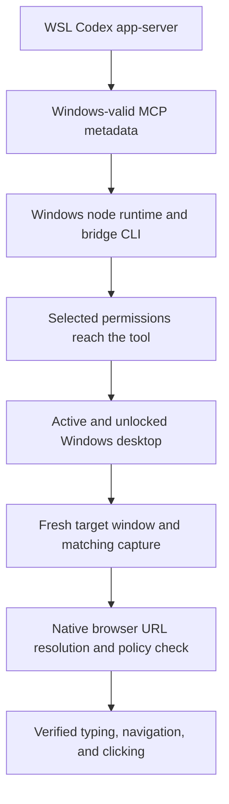

# Native Computer Use with a WSL agent: investigation

Updated: 2026-10-03. Status: **complete native dev-product acceptance passed in
the affected WSL-backed chat using existing Windows Chrome. Authentication,
uploads, actual Stripe sandbox payment, recovery, GUI downloads, native
playback/seek and receipt were exercised through standard `@oai/sky`.
Independent provider and file checks corroborate the result. Two independent
fresh-helper native Chrome startup flows also passed, but a later delayed first
capture reproduced the URL-confidence stop before input. Cold-start reliability
remains unresolved; the optional timing helper is not a universal fix.**

The goal is to operate Windows Chrome through Codex's bundled native Computer
Use API from an existing WSL-backed chat. The agent and repositories stay in
WSL. Completion requires verified typing, navigation, and mouse clicking in
that affected chat, followed by a successful test in another fresh turn and
the actual deployed product flow using the native controller. A successful
Playwright product test is separate evidence.

### Latest regression and revised candidate

The affected chat's later dev end-to-end report explicitly identifies Linux
Playwright as its controller. That run verified upload, sandbox payment,
recovery, download and playback, but native Chrome observations had returned
unchanged state first. It does not establish native product-flow acceptance.

A subsequent Desktop update replaced the runtime cache. The new cache still
contained the exact reviewed Sky 0.7.5 facade, but neither its timing hook nor
the shim. Reapplying the guarded installer restored the hook; a fresh import
verified the actual capture descriptor, rather than the proxy's bound function.

On a normal native Chrome launch, typing the dev URL was visibly successful.
Return did navigate to the site's preview-access redirect, but the first native
capture after the installed two-second interval stopped at URL confidence.
A later read-only inventory and capture returned the correct destination and
password form. This distinguishes successful navigation from a failed capture;
it does not prove an internal URL-detector cause.

The same fresh-tab, typed-URL and dev redirect sequence then passed with a
five-second wait before its first native capture. Input took 82 ms, the wait
5,002 ms, and capture 185 ms. No failed capture or input was retried. This is one
passing diagnostic; caching and other uncontrolled timing differences mean it
does not prove that five seconds alone is a universal repair.

The revised candidate keeps the existing two-second interval for ordinary
Chrome input and uses five seconds after clicks, secondary actions, Enter,
Reload and Back/Forward shortcuts. It still calls the original native capture
once, with unchanged arguments and policy enforcement. This is a bounded delay,
not a page-readiness guarantee. Installer upgrades accept only the exact known
previous shim hash; unknown edits and vendor builds are still refused.

Confidence is **medium-low** in this candidate's applicability to the observed
redirect failure. At this phase cold-launch and affected-chat native product
acceptance were still required; later results are recorded below. Checkpoints
44 and 45 preserve the runtime drift and distinguish the capture failure from
the preceding successful navigation.

### Matched bridge and isolated cold-start failure

Checkpoint 48 established a real version mismatch: the current WSL app-server
and installed Windows CLI were 0.160.0, while the running Windows bridge child
still used the earlier verified 0.159.2 copy. The private bridge settings were
updated to a hash-verified copy of the installed 0.160.0 executable, preserving
the previous binary and settings. WSL remained selected.

Checkpoint 49 checked the live child environment after a supported MCP reload.
The serving adapter had not been replaced and still used the old CLI. A harmless
JavaScript marker and adapter I/O counters identified the serving process. Only
that idle adapter was retired; reloading then started a new adapter whose child
environment pointed at the verified 0.160.0 copy. Neither Chrome nor the WSL
app-server was restarted during that connection update. A reload request alone
is therefore insufficient evidence that startup-only bridge settings took effect.

With the matched bridge, the existing New Tab passed window binding, activation,
capture, typing the dev URL and committed navigation to the preview-access
redirect. Screenshot and native accessibility URL agreed. The first request for
both screenshot and text returned screenshots with null accessibility; the next
text-only request returned the real tree and address-bar focus. Inspection of
the bundled JavaScript client confirmed that both capture options are forwarded
unchanged and null accessibility is accepted. This does not establish why the
native helper returned different capture results.

The successful dev navigation had an 11,582 ms caller interval before capture.
It is not a controlled demonstration that version matching or a five-second
interval repaired navigation.

The owned test window was then closed normally; Windows metadata verified zero
Chrome processes. Native launch returned a fresh New Tab. Each subsequent native
API was called separately. `get_window` and `activate_window` returned, but the
first `get_window_state({include_screenshot:false, include_text:true})` stopped
with the original URL-confidence error. Recorded tool timestamps place that
capture about 41.8 seconds after launch and 11.8 seconds after activation. No
keyboard or mouse input was issued to that fresh window, and no app call followed
the native stop.

This rules out bridge version alignment as a sufficient repair for the observed
cold initial text capture. A wait of more than five seconds was also insufficient
in that case. The earlier Zmodo attempt where input returned without changing
the observed page remains a distinct unresolved observation; it emitted no
URL-confidence error.

The next controlled variable is the native initial capture mode, compared in a
fresh turn and fresh Chrome launch. Confidence is **medium** that this comparison
can distinguish behavior, and **low** that it alone is a complete repair. Native
URL checks and stop handling remain enabled; changing capture options must never
be used to retry a stopped turn or manufacture a browser URL. Full native product
acceptance is still outstanding.

### Initial capture mode comparison

Checkpoint 50 changed the first cold capture to request both screenshot and text.
Chrome was closed normally, Windows reported zero Chrome processes, and native
launch produced one fresh New Tab. Window binding and activation returned; the
first combined capture then stopped with the same URL-confidence error. No
input or further app call followed. Changing the requested capture outputs is
not a sufficient repair. The preparatory read of the prior window again returned
screenshots with null accessibility; that observation does not establish a
policy-approved browser URL or explain the cold failure.

Windows metadata identified Chrome 154.0.8037.97, session 1, with no accessibility,
UIA-provider or remote-debugging startup override. Current Chromium research
discarded an obsolete provider-toggle experiment: Google's
[release notes](https://support.google.com/chrome/a/answer/10314655?hl=en-14)
remove `UiAutomationProviderEnabled` at Chrome 147. The current accessibility
features source no longer defines `UiaProvider`, and the installed Chrome DLL
contains neither feature/policy name. No registry or browser policy was changed.

The earlier complete-accessibility trial was also reviewed by failing phase.
Its initial capture passed, while its fresh-turn repeat failed after immediate
Ctrl+T, before the settling helper existed. Chromium's
[accessibility overview](https://github.com/chromium/chromium/blob/main/docs/accessibility/overview.md)
documents on-demand accessibility and the supported complete startup mode.
A new controlled combination can therefore compare proactive accessibility at
startup with normal cold Chrome while retaining the current native controller,
matched bridge and settling hook. This is a hypothesis; the earlier flag-alone
results do not establish that it repairs today's cold New Tab or the product
flow. Confidence is medium in its diagnostic value and medium-low as a full fix.

The affected chat completed an offline review of the two built-in Sky connection
paths. Historical shared-route retries occurred after directory and child CLI
repairs, but no recorded comparison first verified the Desktop-owned shared
helper's own CLI selection. Current bundled Desktop code selects that CLI from
its parent environment; the adapter's child-only override does not change it.
A route comparison remains untested and requires independently verified shared
helper prerequisites. Confidence is medium-high in its diagnostic value and low
that a route change alone repairs browser capture. Neither this review nor a
native stop authorizes a fabricated URL, a retry in the stopped turn, or another
browser controller as native acceptance.

### Startup controls and a clean helper session

Checkpoints 52–54 tested new initialization variables on the current runtime.
The first preparatory read returned Chrome accessibility with a screenshot of
Codex. Explicit activation followed by capture returned matching Chrome pixels
and text. That observation limits reliance on an occluded-window screenshot;
it does not prove the earlier Zmodo unchanged-input cause. No screenshot or
private browser tree was saved to the investigation artifacts.

After a normal close and verified zero Chrome processes, the diagnostic
launcher started Chrome with complete accessibility. First cold capture,
Ctrl+T, visible literal typing, Return navigation, a semantic Learn more click,
Back and Reload all passed through native Sky. Captures followed input
immediately in the same JavaScript call; the reviewed helper supplied the
two/five-second intervals. Screenshot and accessibility agreed at each stage.
This was a complete public-browser flow, not a native Zmodo product run.

Two controls then removed proposed explanations. The same diagnostic launcher
without the accessibility flag passed first cold capture. Normal native
`sky.launch_app` also passed it. Both used activation and capture in one call.
The real main-process flags and parent PIDs were recorded. These passing
controls reused the helper after successful browser observations; they do not
prove that a startup flag, launcher choice or same-call activation is the fix.

The owned window was closed normally and Windows again reported zero Chrome
processes. Resetting only the root JavaScript kernel produced a fresh native
helper. The imported capture hook was verified active. Normal native Chrome
launch returned a new window; activation returned, but its first screenshot
plus text capture hit the URL-confidence stop. Activation and capture were
still in the same call. No browser input was issued to the fresh window and
no native app call followed the stop. Chrome's parent, the native helper,
changed from PID 39372 to PID 7992. A subsequent metadata query identified
PID 7992 as `codex-computer-use.exe`; its own parent was PID 47512. WSL,
current CLI 0.160.0, Sky 0.7.5, the settling hook and browser flags
were unchanged.

This makes helper initialization or retained state a stronger hypothesis.
Confidence is high in the observed distinction and medium in its diagnostic
value; the internal cause remains unproven. The exposed JavaScript metadata
did not supply a sandbox profile in the read-only follow-up, which is not
evidence that the tool's actual permissions were missing or changed.

The next fresh turn compared complete-accessibility startup with a clean
helper and a matching default-mode control, recorded below. A supported
non-browser state capture before normal cold Chrome was then an unexecuted
hypothesis with medium diagnostic confidence and low confidence as a complete
repair. Checkpoint 70 later tested it, and checkpoints 71–73 passed controls
without it; these results do not establish non-browser capture as a repair.
A native stop ends GUI work for its turn.

The affected chat separately refreshed its own idle adapter and verified the
actual Windows child now uses CLI 0.160.0, Sky 0.7.5 and pipe flag 0. It made no
desktop actions. Independent native product acceptance has not started.

### Clean-helper external-launch comparison

Checkpoints 56–57 verified zero Chrome processes before each trial, reset the
root JavaScript kernel, initialized the bundled Sky client and used the same
diagnostic launcher. Windows metadata independently confirmed different fresh
native helper processes. The Chrome version, WSL engine, current child CLI,
per-runtime route and timing hook remained matched; the startup flag differed.
Both trials activated and captured in the same call, with no caller sleep.
Startup intervals were observed rather than precisely matched.

With complete accessibility, the first screenshot/text request returned
matching Chrome pixels but `accessibility: null`. It did not emit a native
URL-confidence stop. A normal native Ctrl+L followed by immediate capture
returned the address-bar focus and accessibility tree. Literal typing of the
actual Zmodo dev URL was visible in pixels and the address field. A separate
Return plus capture reached the expected preview-password gate; screenshot,
title, address and document URL agreed. Authentication was not attempted.
This proves navigation through that gate in this trial, not the upload,
checkout or recovery flow.

The same launcher without the accessibility flag also returned matching
Chrome screenshots from a fresh helper. Its first capture likewise had no
accessibility text. Thus the flag is not required for these observed initial
results. Both trials started Chrome outside the native helper, unlike the
fresh native-launch failure in checkpoint 54. Launch path, timing and native
or browser initialization remain hypotheses; none is a proved cause.

The affected chat's independent offline lifecycle review found cached facade
and service clients, reference-counted transports and a reused native helper.
Each capture still sends a native request. The visible JavaScript contains no
browser URL extractor or UI Automation initialization routine, and no
kernel-reset cleanup guarantee. Actual helper PID changes provide stronger
reset evidence than recreated JavaScript bindings. These findings do not
identify a native URL cache or a particular internal failure.

The normal externally launched window was handed to the affected chat for a
fresh native navigation regression test, recorded below. Native product
acceptance remains outstanding. Confidence is high in the recorded
observations, medium in their diagnostic value and low in a complete repair.

### Affected-chat native navigation acceptance

The affected chat completed `zmodo-native-navigation-4` using its matched
Windows CLI 0.160.0, Sky 0.7.5 and per-runtime route. It reset only its own
JavaScript kernel before initialization, selected the one returned normal
Chrome window and used native Sky for every browser action. Chrome's process
identity remained unchanged; no accessibility or remote-debugging flag was
present. The root had already captured this window, so this is independent
chat acceptance on an existing browser, not an untouched cold-browser test.

Its initial screenshot/text capture again returned matching Chrome pixels
with null accessibility. Ctrl+L plus immediate capture reported real address
focus. One literal dev-URL typing action matched both the native address
field and visible pixels. A separate Return plus capture reached the preview
gate with matching document URL, title and address value. Captures took
5,342 ms initially, 2,237 ms after focus, 2,237 ms after typing and 6,526 ms
after Return. No caller wait, native error or physical Escape stop occurred.
The prior unchanged-input symptom did not recur in this trial. Multiple
runtime and startup variables have changed since the earlier failure;
this does not identify which change resolved that observation.

The chat stopped at authentication and persisted sanitized process metadata,
timestamps and field outcomes. Human preview access and test-account login
were requested. No authentication, upload, checkout, recovery or download was
automated in this acceptance. The separate Playwright product pass continues
to be recorded independently.

Process snapshots during the handoff showed the root's native helpers absent
while its parent Node process remained alive; the root JavaScript bindings
also survived the other chat's kernel reset. The affected chat's own helpers
were present. Neither snapshot establishes when or why the earlier helpers
exited, or proves a cross-chat termination bug. The visible transport has
close, pending-request timeout, parent-exit and physical Escape cleanup paths;
the native implementation's lifetime remains unverified. Checkpoint 58
preserves this observation without claiming a cause.

### Read-only helper coexistence and exit recording

The root next used its retained Sky facade for `list_apps` and `get_window`
only. Inventory started a new root helper while the affected chat's existing
broker and secondary helper stayed alive. Window binding also left those
processes alive. This rules out universal cross-chat termination during these
read-only stages; activation, capture and simultaneous input were not tested.
Checkpoint 60 preserves the returned window identity and process snapshots.

A private, bounded metadata recorder was then verified using a retained .NET
process handle. An owned hidden PowerShell child exited with the chosen code
37; an independently attached handle recovered that code after the owning
handle was closed. A separate two-second sample attached to both chats' Node
parents and all three existing native helpers without access errors. All five
processes remained alive; no actual helper exit was observed in that sample.

The recorder reads process identity and exit metadata only. It performs no
app activation, capture or input, and does not change the native connection or
stop controls. Polling can miss a process that starts and exits between samples;
an exit code alone also cannot identify which component requested termination.
Checkpoint 61 records its verification and scope. The next capture experiment
can retain handles before the action, rather than infer an exit from a missing
PID afterward. At that checkpoint, native product acceptance and human
authentication remained open.

### Native product flow through test checkout

The affected chat's `zmodo-native-e2e-6` resumed with direct human authorization
to handle the existing test-account authentication. It used standard native
`@oai/sky` on Windows Chrome with WSL retained throughout. Preview access,
account sign-in, two-file selection, both first-frame thumbnails, full uploads,
the saved quote, purchase terms and checkout acknowledgment controls passed.
The two recordings totalled 919,720 bytes and the quote was $50 USD.

Actual embedded Stripe checkout showed TEST MODE. Separately labelled read-only
provider and database checks found `livemode=false`, an open unpaid session,
an amount of 5,000 USD cents and an agreement covering both recordings. Those
checks corroborate checkout configuration; they are not a native payment pass.
At that checkpoint the final Pay action was prepared, and action-time
sandbox-payment confirmation was requested in the affected chat. Payment,
recovery, download, native playback/seek and receipt had not yet been exercised.

One native OS-picker `set_value` call returned an unavailable cached-element
error for Chrome. Fresh native keyboard observations recovered file selection.
Native focus metadata also differed from visible field focus; the trial
compared live observations rather than treating that metadata as conclusive.
Neither issue was a URL-confidence or physical Escape stop. No alternate
browser controller was used. Checkpoint 67 records those intermediate stage
artifacts. The completed continuation below supersedes the pending stages.

### Complete native dev-product acceptance

The orchestrator had explicitly told the affected chat to retain final payment
confirmation. This applied a financial-transaction guideline too broadly to
the already authorized no-real-money sandbox test. Checkpoint 68 records the
correction. The original checkout expired during that hold and stayed unpaid.
Native Change payment method recovered checkout for the same uploaded batch.
The fresh actual provider session was checked before Pay: `livemode=false`,
5,000 USD cents, open and unpaid.

The affected chat's final `zmodo-native-e2e-8` is **PASS**, completed October 3
at 15:11 UTC. Every GUI action used standard Windows Chrome Computer Use
`@oai/sky`; the selected engine remained WSL. Native Pay completed the test
payment, both recordings recovered, the thank-you page linked the batch, and
Chrome downloaded both MP4s and both metadata JSONs. Both MP4s actually played,
replayed and sought backward. Payment history and receipt showed the expected
provider, amount and two filenames. Minimal metadata and 30-day retention were
also verified. No real money was charged.

Separately labelled read-only verification found the provider session complete
and paid, one paid database payment and one canceled old checkout. Both child
recoveries completed about 13 seconds after the payment timestamp. Each MP4
was 448,708 bytes; actual downloaded hashes matched stored output hashes. The
metadata download hashes also matched. These checks corroborate native actions
without replacing payment, upload, download or playback with another controller.

The run recorded 62 native events. Indexed Stripe Pay clicks twice resolved
outside the window and were rejected before dispatch. A fresh screenshot-backed
native coordinate click submitted the verified test payment. Earlier picker
cache and focus discrepancies remained in the evidence. No URL-confidence
denial, physical Escape stop, helper reset, alternate GUI controller or native
policy modification occurred. Ordinary element/focus errors therefore remain
distinct from the earlier native URL-confidence stop.

Checkpoint 69 preserves hashes of the sanitized acceptance artifacts and the
independently checked downloads. The prior Linux Playwright pass remains
separate. This result validates the dev Stripe MP4 batch workflow with an
existing Chrome window; cold Computer Use startup, PayPal and live production
payments were not exercised. Fresh-helper native-launch reliability remains
open.

### Fresh-helper startup controls and a later native stop

The same installed configuration was retained throughout checkpoints 70–75:
WSL agent, Desktop 26.930.3748.0, plugin 26.930.31428, Sky 0.7.5, matched CLI
0.160.0, Chrome 154.0.8037.97 and the existing guarded timing hook. No runtime
patch, complete-accessibility flag or URL-policy change was introduced for
these trials. Fresh kernels were initialized before tests, never to bypass a
native stop.

| Trial | Changed variable or sequence | Observed result |
| --- | --- | --- |
| Checkpoint 70 | Capture Calculator before native cold Chrome | First launch restored an HTTPS page and passed capture, so it was a confounded control. After preparing a single New Tab and fully exiting Chrome, a fresh-helper repeat passed first capture and the full public typing/navigation/link-click flow. |
| Checkpoint 71 | Remove the Calculator capture and match the prior 56.410-second helper-age delay; Calculator remains in the background | First New Tab capture passed. A preliminary non-browser capture was not required for this observed pass. |
| Checkpoint 72 | Remove the deliberate startup delay; Calculator remains in the background | Native launch began 279 ms after initialization and first New Tab capture passed. Only initial capture was tested. |
| Checkpoint 73 | Exit both Chrome and Calculator; fresh helper, no other-app capture or deliberate startup wait | Native launch began 271 ms after initialization. First New Tab capture, literal typing, committed Example Domain navigation and the native IANA link click passed. |
| Independent affected-chat case A | Zero Chrome/Calculator processes and fresh helper; launch, selection, binding, activation and first capture in one JavaScript call | First New Tab capture and the full public typing/navigation/link-click flow passed. Binding-to-capture interval was 86 ms. |
| Independent affected-chat case B | Same clean preconditions; launch, binding and activation/capture in separate JavaScript calls | First New Tab capture and the same full public flow passed. Binding-to-capture interval was 23,365 ms. |
| Checkpoint 75 | Separate native calls intended to match the earlier checkpoint-54 launch/binding/capture timing | Binding followed launch return by 16,166 ms. First capture actually began 196,816 ms after binding and returned the original native URL-confidence stop before any browser input. The intended 13,474 ms binding-to-capture interval was not achieved. |

The affected chat recorded its independent A/B result as
`zmodo-native-startup-regression-2`, **PASS**, at 16:52 UTC on October 3. Both
cases used standard native `@oai/sky`, began on New Tab, and ended with a native
Chrome exit and independently verified zero Chrome/Calculator processes. No
native error, URL-confidence stop, Escape cancellation, startup sleep or
preliminary non-browser capture occurred in those cases. Checkpoint 76 hashes
their sanitized reports and retains the later troubleshooting-chat failure.

Checkpoint 75's original error was preserved. No native GUI call or reset
followed it. Its unexpectedly long call interval makes it a delayed-capture
failure, not a matched reproduction of the historical timing. The timestamps
do not establish why the interval grew or whether elapsed time caused the
native denial. Longer startup waits, non-browser warm-up and grouping calls
cannot be claimed as universal repairs from these results.

Confidence is **high** in the recorded complete product and independent startup
passes, and **high** that a native first-capture failure still occurred in this
configuration. Confidence is **low** in a complete cold-start repair or a
specific internal cause. The goal remains incomplete. A subsequent authorized
fresh-turn diagnostic should measure actual timing within a bounded sequence
and compare window-binding freshness, without bypassing native URL checks.

## What the evidence currently establishes

The investigation has encountered several independent failures. Repairing an
earlier stage allows the next stage to run; it does not prove the later stage
works.



The URI and Windows-child launch repairs have cleared startup failures. Reloading
MCP connections cleared stale permissions in the affected chat. Chrome keyboard
and mouse navigation passed in the troubleshooting chat on October 1. An earlier
affected-chat attempt opened a tab and typed, but navigation ended with the
native URL-confidence stop; that attempt did not verify page load or mouse control.

On October 2, a later native inventory exposed no targetable Chrome window.
The supported native launch restored one New Tab window. A fresh read-only
baseline then returned from `get_window` but failed in `get_window_state` with
the same URL-confidence stop, before any keyboard or mouse input. This pins
down that attempt's failing API.

The user then loaded Example Domain and put Chrome in the foreground. A native
read-only baseline succeeded. **Two subsequent fresh-turn tests in the existing
affected chat each verified typing, committed navigation, and mouse clicking.**
The typed URLs were `https://example.com/?codex_wsl_cua=1` and
`https://example.com/?codex_wsl_cua=2`; each loaded the expected document and its
visible Learn more link led to `https://www.iana.org/help/example-domains`.
The second test started on IANA, establishing cross-origin navigation as well.
Screenshot, accessibility text, and document URL agreed; neither test returned
a native error. This satisfies the two fresh-turn input acceptance tests.

A separate controlled test then explicitly activated Chrome and confirmed a
matching IANA baseline. `Ctrl+T` returned successfully, but its immediate
`get_window_state` produced the URL-confidence stop. No typing or navigation
from the New Tab was attempted. **Foreground activation alone did not repair
this failure.** The two successful loaded-page tests do not establish a universal
URL-resolver repair.

A later fresh-turn observation of the existing New Tab succeeded with matching
screenshot/accessibility and native document URL `chrome://new-tab-page/`.
Another fresh turn then completed typing `https://example.com/?codex_wsl_cua=3`,
committed navigation, and the Learn more click to IANA with no native error.
**Three complete native input tests have now passed in the affected chat.**

A controlled comparison then focused the address bar on IANA, typed
`https://example.com/?codex_wsl_cua=4`, and used Chrome's `Alt+Enter` shortcut.
Typing and the key action returned, but the immediate `get_window_state` again
produced the URL-confidence stop. No observation or input followed; new-tab
creation, committed navigation, and the link destination were not verified.

These observations distinguish successful use of a previously opened New Tab
from unsuccessful immediate state reads after tab-creation actions. A
transition or accessibility-initialization issue is a hypothesis, not a proven
internal cause. The latter failure remains the reliability gap.

The human authorized the reviewed diagnostic launch. Its guard first refused
because Chrome processes remained. After Chrome fully exited, the launch
succeeded and the real Windows main process contained
`--force-renderer-accessibility=complete`. The first native test found no window
because the human had closed Chrome again; this did not test the flag.

After an authorized relaunch, the affected chat verified an initial capture of
`chrome://whats-new/`, `Ctrl+T` followed immediately by a successful state read
of `chrome://new-tab-page/`, typing `https://example.com/?codex_wsl_cua=5`, and
committed navigation with matching Example Domain content. Computer Use then
stopped during `LEARN_MORE_CLICK` with **“Computer Use was stopped by the user
with the physical Escape key.”** No further Computer Use occurred in that turn.
The IANA destination was not verified. This is the first passing immediate
New Tab capture under the candidate startup flag, but a complete flow and a
fresh-turn repeat are still needed. It does not establish that the flag caused
the improvement. Checkpoints 31 and 32 record the launch and partial native test.

The human confirmed the Escape interruption was intentional and explicitly
authorized resumption. Before the fresh test, the same real Chrome main process
was checked again and still had the complete-mode flag. Native discovery,
activation, and a matching Example Domain baseline passed. `Ctrl+T` returned,
but `NEW_TAB_IMMEDIATE_GET_WINDOW_STATE` produced the original URL-confidence
stop. Typing the sixth URL, committed navigation, and clicking were not
attempted, and all Computer Use stopped immediately. **The complete-mode flag
has not produced a reliable fix in this configuration.** Checkpoint 33 records
the failed repeat; the launcher has not been promoted to a public fix script.

### Capture timing experiment and deployment

The next diagnostic changed when the **first** state request occurred after
Ctrl+T. It did not retry a failed request. From a verified loaded HTTPS baseline,
two fresh turns each waited 2,000 ms after the successful key action and before
the first native capture. Both returned `chrome://new-tab-page/`, verified typed
and committed Example Domain URLs, and clicked Learn more to IANA without a
native error. The first action/wait/capture sequence took 2,221 ms; its repeat
took 2,230 ms. These passes retained the complete-accessibility launch flag, so
they established a timing candidate, not yet independence from that flag.

The reviewed Windows JavaScript backend had no visible settling step comparable
to the Linux client's action settler. This does not establish what the native
binary does internally. A reversible first deployment wrapped that backend
module, but the live RPC session still captured in 129 ms and stopped at URL
verification. That edit was rolled back exactly; its original SHA-256 is
`617d8e6e18fdde25f06d4cba2c84c994e076e05f30a8c55d09e918401c48b171`.
No further Computer Use occurred in the failed turn.

The corrected deployment hooks the **imported Sky entry facade** on its Windows
target, which is the active RPC boundary in this session. It only delays Chrome
capture after a successful native input or activation, calls the original
method once with the original request, and returns its state or error unchanged.
The native backend and URL policy are retained. The installer is guarded by
the reviewed Sky 0.7.5 facade hash and can restore the original bytes.

Resetting the idle JavaScript kernel before importing Sky activated the new
facade; an MCP reload alone had not refreshed the module. Static inspection
confirmed the active wrapper before any browser calls. In the affected chat,
ordinary Sky calls then verified the loaded query13 baseline, immediate Ctrl+T
capture of `chrome://new-tab-page/`, typing and committed query14 navigation,
and the Learn more destination `https://www.iana.org/help/example-domains`.
Screenshot, accessibility text, and native document URL agreed throughout.
Ctrl+T took 80 ms, the gap before capture was 0 ms, and capture took 2,162 ms.
There was no manual wait or native error. Checkpoint 37 records this first
complete deployed pass. The fresh-turn repeat also passed without a kernel
reset: query15 baseline, immediate valid New Tab, committed query16, and the IANA
click. Ctrl+T took 81 ms, the capture call began immediately and took 2,135 ms,
and there were no native errors or manual waits. Checkpoint 38 records both
consecutive passes.

The human's earlier explicit permission to terminate and relaunch Chrome was
then used to exit the flagged process. Its identity was checked before stopping
only Chrome processes in its Windows session; zero remaining processes were
verified. In a fresh turn, ordinary native `launch_app` with the returned Chrome
app ID succeeded in 1,005 ms, with no extra flags. Read-only Windows process
metadata confirmed the new main process had no forced accessibility flag.
Initial capture returned `chrome://new-tab-page/`. The full query17/query18 and
IANA click flow passed with matching screenshot/text/URL and no native error.
Ctrl+T took 81 ms, its immediate capture took 2,182 ms, and no manual wait or
kernel reset was used. The normal default-browser prompt was dismissed with
Set later; Restore pages was left available. Checkpoint 39 records the first
standalone normal-launch pass. The final fresh-turn repeat also passed: loaded
query19 baseline, immediate valid New Tab, committed query20, and IANA click.
Ctrl+T took 80 ms, capture began with a zero-millisecond gap and took 2,184 ms,
and screenshot/text/URL agreed. No manual timer, kernel reset, or native error
occurred. The same normal Chrome main process was rechecked after the repeat;
it still had no forced accessibility flag. Checkpoint 40 records two consecutive
complete flows on normally launched Chrome. The installed helper therefore
has four complete deployed passes, two independent of the startup experiment.

| Installed helper test | Startup configuration | First capture after Ctrl+T | Complete flow |
| --- | --- | --- | --- |
| Query13/query14 | Experimental complete-accessibility flag | 2,162 ms | New Tab, typing, committed Example Domain, IANA click passed |
| Query15/query16 repeat | Same flagged Chrome; no kernel reset | 2,135 ms | All stages passed |
| Query17/query18 | Normal native launch; flag absence verified | 2,182 ms | Initial capture and all input stages passed |
| Query19/query20 repeat | Same normal Chrome; no kernel reset | 2,184 ms | All stages passed |

Every action-to-capture call gap was 0 ms; the helper supplied the settling
interval internally. Native URL policy, original requests, and error propagation
were retained. The installer and JavaScript helper tests also passed, including
exact restoration, unknown-build refusal, and unchanged native stop handling.

### Independent acceptance review

After the implementation and initial results were persisted in commit
`75fedd44a6199643741a913e2940aa6b41a15e64`, the affected WSL chat independently
tested the installed fix using its own fresh observations and a unique public
test URL. **All 11 acceptance criteria passed, with zero native errors.**
The browser test ran on October 2 from 20:26:29 to 20:32:40 UTC. JSON and
Markdown evidence were saved privately, and the chat sent its requested report
back to the troubleshooting thread after verifying the human's authorization.

The test observed the active Windows timing facade before app calls, freshly
selected exactly one returned Chrome window, explicitly activated it, and
inspected matching screenshot/accessibility state. It then opened New Tab,
typed and committed its unique Example Domain URL, clicked Learn more to IANA,
used Back to return to the exact test URL, and reloaded the page. Each action
had an immediate native capture in the same JavaScript cell.

| Acceptance action | Action (ms) | Gap before capture (ms) | Capture (ms) | Verified result |
| --- | ---: | ---: | ---: | --- |
| Activate | 230 | 0 | 2,253 | Matching IANA screenshot, native URL, and text |
| Ctrl+T | 91 | 0 | 2,181 | `chrome://new-tab-page/` and focused address field |
| Type unique URL | 89 | 0 | 2,170 | Exact focused field value; navigation not yet committed |
| Return | 86 | 0 | 2,201 | Exact test URL and Example Domain page content |
| Learn more click | 110 | 0 | 2,182 | `https://www.iana.org/help/example-domains` |
| Back | 131 | 0 | 2,197 | Exact test URL, rendered page, and accessibility body |
| Reload | 104 | 0 | 2,163 | Same test URL and correct page content |

The evidence recorded no manual timers, kernel resets, implementation edits,
startup-flag changes, alternate controllers, or shell UI actions. The prior
three tabs were retained, one test tab was added, and Restore pages remained
available. This independent turn did not cold-launch Chrome or inspect its
process flags; those checks belong to the earlier normal-launch tests and
separate root metadata inspection.

One field limitation was preserved: after Back, `document_text` contained only
the URL. The already-returned accessibility tree contained the correct body and
Learn more link, and the native RootWebArea URL and screenshot agreed. Back
passed using that corroboration, without an extra capture or recovery loop.
Reload returned the full expected body in `document_text` again.

The troubleshooting thread reviewed the saved JSON/Markdown and executed API
calls, checked all 11 criteria, seven captures, zero native errors, timing
arithmetic, zero caller delays, and tab preservation. It also verified that no
manual timer or session reset appeared in the test calls. The acceptance verdict
is **PASS for this current native Chrome configuration**; it does not establish
every browser/site/runtime or acceptance of the Zmodo application's product
flows. Private reports retain the exact test-turn identity and unique query URL;
screenshots, session/auth data, unrelated browser contents, and machine-specific
paths are not included in this public summary.

The previously observed native URL error is:

```text
Computer Use has been stopped for this turn because it could not determine
the current browser URL on Windows with enough confidence to enforce policy.
Stop your work and send a final message noting why Computer Use ended.
```

That error reports unsuccessful URL verification. It does not identify which
internal stage failed or establish that the intended public site was denied.

## Issues and attempts recorded so far

The numbered evidence references below identify local diagnostic checkpoints.
They distinguish live native-tool results from isolated probes, unit tests, and
untested proposals. Private logs and configuration are not published here.

| Issue | What we tried | Observed result | Current conclusion / evidence |
| --- | --- | --- | --- |
| Project creation sends Windows/UNC roots to the WSL app-server | Separate project-root JSONL proxy | Existing project-path workaround published independently | Keep separate from Computer Use; see the main README |
| Windows `node_repl` rejects `file:///home/...` before JavaScript runs | Compare original URI with the same directory represented through WSL UNC | Original rejected; translated URI executed the isolated test | URI mismatch confirmed; checkpoints 1–3 |
| Initial adapter handled mounted Windows drives but missed Linux-native WSL directories | Add `wslpath` mapping and reverse directory-identity validation | Both drive and WSL mappings passed checks; native app enumeration subsequently worked | Startup repair works; checkpoints 2–5 |
| Windows bridge inherited the Linux project-proxy script as `CODEX_CLI_PATH` | Give only the Windows child a copied, verified Windows CLI; retain the WSL agent | Cleared the Windows-executable launch problem | Child launch repair retained; checkpoints 5–8, 13 |
| Shared Desktop native helper route remains incompatible with the global WSL selector | Use the bundled SDK's per-runtime fallback with `SKY_CUA_NATIVE_PIPE=0` | Native API calls and later Chrome input worked through that route | Native `@oai/sky` API is retained, but the Desktop shared connection has not been restored; checkpoint 13 |
| Windows child CLI differed from the installed package | Align the child with bundled CLI 0.159.0 and required native companions | Fresh configured probe imported Sky and enumerated apps | Version repair cleared startup; did not establish a URL-check repair; checkpoint 8 |
| An old adapter process kept serving calls after source changes | Identify the serving adapter, retire the old process, reload MCP connections; later add request-time loading | Actual tool received the URI translation | JavaScript reset alone does not replace the MCP launch; checkpoints 10, 12 |
| A standalone probe could not display app approval | Test import/enumeration without granting app consent; use the real chat tool for subsequent actions | Probe reached approval but lacked its UI | Standalone discovery is not a browser-control acceptance test; checkpoint 5 |
| Managed permissions still contained Linux filesystem paths | Translate permission paths to the same Windows-accessible objects in an isolated experiment | Windows path parsing advanced, then ACL setup failed on WSL UNC roots | Restricted WSL support remains unresolved; experimental changes rolled back; checkpoints 9–10 |
| Windows ACL enforcement failed on the WSL workspace | Test the existing elevated backend and repair missing bundled sandbox companions | `GetSecurityInfo` error 1 on UNC workspace roots | Simple path translation cannot repair this managed-profile failure; checkpoint 9 |
| The user selected Full Access, but the native tool still received a managed profile | Reset JavaScript, compare turn metadata with adapter audit, send supported `config/mcpServer/reload` | Reset failed to refresh permissions; MCP reload delivered `disabled` and restored enumeration | Confirmed stale-connection failure; checkpoints 16, 21–23 |
| Disconnected or locked Windows session blocked capture/input | Query Windows session/process metadata; reconnect and retest; later use the physical desktop | `GetCursorPos` access denied and monitor-capture errors correlated with inactive/locked sessions | An active desktop is necessary; physical-desktop Chrome test later passed; checkpoints 11, 18–20 |
| Remote access appeared usable while the helper's session changed state | Compare target process session, lock state, and live browser marker; bounded wait for active session | A session briefly active/unlocked later became disconnected/locked | Remote UI access alone did not establish a continuously usable helper desktop; checkpoint 19 |
| A possible accidental cancellation interrupted a test | Honor the stop, then perform a user-authorized fresh retry after checking session state | Session remained disconnected during the bounded wait | No successful input claim from that retry; checkpoint 19 |
| Chrome accessibility described Chrome while the screenshot showed Codex | Explicitly activate the returned Chrome window and reacquire screenshot/text | Capture then matched Chrome; subsequent root-chat input succeeded | Confirmed capture/focus discrepancy; its cause in the affected chat is still unproven; checkpoint 20 |
| Brave captures worked but later browser input hit URL-confidence enforcement | Native enumeration, activation, fresh capture, keyboard/click tests | Some early capture/click success; later input stopped | Reliable Brave control remains unverified; Chrome is the user's selected browser; checkpoints 6, 17, 20 |
| Full Codex restart did not produce a complete browser repair | User fully quit and reopened the application; inspect actual post-restart state | Discovery worked; inactive desktop and URL-confidence failures remained | Restart was not a verified universal fix; checkpoints 17–19 |
| Browser settings displayed an organization/region availability message | Read actual availability logs and the installed frontend decision | Local `reason=wsl-disabled` and corresponding WSL checks found | This was a Browser Use availability decision, not proof of an organization/region restriction; checkpoint 15 |
| Browser extension / Chrome developer integration might solve it | Inspect installed extension metadata and native/browser availability | Chrome extension was present; the WSL availability gate remained | Extension installation does not remove that gate; no proven native URL repair; checkpoints 14–15 |
| Different chats appeared to have different browser capabilities | Compare actual turn and MCP permission metadata; serialize native browser tests | Managed-vs-disabled and stale permissions explained startup differences | Shared foreground can interfere with input, but it was not the demonstrated cause of the path-parser failure; checkpoints 21–23 |
| Chrome worked in one chat but remained unreliable in the affected chat | In a fresh target-chat turn, select/activate Chrome, open a new tab, type a public URL, then press Enter and refresh | New tab and typing verified; navigation step stopped; click test never ran | Earlier incomplete acceptance attempt; checkpoint 23; subsequent loaded-page tests passed at checkpoints 27–28 |
| New-tab input/refresh returned an uncertain outcome | Reacquire a fresh window/state before another action | Confirmed the tab had opened | The wrapper did not preserve the original cause, so the specific initial failure remains unknown; checkpoint 23 |
| Need a reusable permissions refresh | Add `refresh-computer-use.py` with a dry run and process/pipe identity checks | 46 repository tests passed; real dry run and reload request succeeded; published in `bd9eb79` | Repairs stale MCP connections, not the native URL resolver; checkpoint 23 |
| Native inventory later reported no targetable Chrome window | Compare native discovery with Windows process/session metadata, then use the documented native `launch_app` recovery | Chrome had a Windows main window, but native inventory returned zero; one native launch returned one Chrome New Tab window | Target visibility restored for this attempt; its previous absence remains unexplained; checkpoint 26 |
| Fresh New Tab observation failed before any browser input | Fresh selection, separate `get_window` and `get_window_state` phase markers, one native observation | `get_window` returned; `get_window_state` produced the original URL-confidence turn-stop; no state or input followed | Pre-input state-read failure for New Tab; later loaded HTTPS baseline succeeded; checkpoints 26–27 |
| Need complete input acceptance in the affected chat | User prepares loaded Example Domain; select and explicitly activate a fresh native Chrome window; type, commit, observe, click, observe | Both query-bearing documents and both Learn more destinations verified in two fresh turns; no native errors | Loaded-page control verified in the existing WSL-backed chat; checkpoints 27–28 |
| Does foreground activation alone fix New Tab? | Start from matching IANA screenshot/text/URL after explicit activation; one `Ctrl+T` followed immediately by native state refresh | Key action returned; `get_window_state` failed with the original URL-confidence stop; no further input | New Tab startup unresolved; foreground alone insufficient for this controlled attempt; checkpoint 28 |
| Is a previously opened New Tab permanently unreadable? | One fresh read-only selection/activation/state observation, followed by a complete input test in another turn | Native `chrome://new-tab-page/` state read passed; typing, committed Example Domain navigation and IANA click all passed without native errors | Existing New Tab was usable; immediate creation refresh was still unresolved at checkpoint 29, before the later timing helper |
| Does opening a public URL directly in a new tab avoid the failing refresh? | From a verified IANA baseline, type the harmless fourth test URL and use native `Alt+Enter`, then immediately observe | Typing and key action returned; refresh failed with the original URL-confidence stop; tab creation and navigation were not verified | The immediate-refresh failure extends beyond blank `Ctrl+T`; no input or state read followed; checkpoint 30 |
| Could Chrome accessibility initialization affect the first observation? | Launch the reviewed default-dry-run script after Chrome exits, verify its real startup flag, then use native Sky in the affected chat and repeat after explicit human resumption | First initial capture, immediate Ctrl+T capture, typing, and navigation passed; physical Escape interrupted click. Fresh-turn repeat still stopped immediately after Ctrl+T with the original URL-confidence error | Complete accessibility is insufficient for reliable tab creation in this configuration; not promoted as a public fix; checkpoints 31-33 |
| Does settling before the first native capture affect the transition? | After a successful Ctrl+T from a verified loaded HTTPS page, wait 2,000 ms before the first capture; preserve normal native policy | Two fresh-turn tests completed valid New Tab capture, typing, committed navigation, and IANA clicking without a native error | Timing candidate reproduced; complete-accessibility flag still present; checkpoints 34-35 |
| Does wrapping the Windows backend module affect the live client? | Version-guarded reversible deployment, then immediate native capture without a manual wait | Capture remained 129 ms and stopped at URL confidence; no further Computer Use that turn | First deployment did not affect the live RPC path; original backend restored; checkpoint 36 |
| Can ordinary Sky calls use the settling candidate automatically? | Hook the imported Windows-target facade, reset the idle JavaScript kernel once before app calls, verify active wrapper, perform the full native flow without a manual timer; repeat without resetting | Both complete flows passed, including immediate valid New Tab; captures 2,162 ms and 2,135 ms; no manual waits or native errors | Two consecutive deployed passes verified; standalone normal-launch test also passed later; checkpoints 37-39 |
| Does the timing helper depend on the complete-accessibility flag? | Authorized identity-checked Chrome termination, documented native launch without flags, real-process flag checks before/after testing, complete flow and fresh-turn repeat | Normal launch and both complete query17/query18 and query19/query20 flows passed; immediate New Tab captures 2,182 ms and 2,184 ms | Two consecutive standalone passes verified; checkpoints 39-40 |
| Does complete accessibility fix a clean helper? | Zero Chrome processes, fresh helper identity, same external launcher with and without the flag, same-call activation/capture | Both first captures returned matching screenshots with null accessibility. The flagged trial subsequently verified literal dev typing and navigation | Flag not required for these observed initial results; native launch and full product reliability unresolved; checkpoints 56-57 |
| Does the affected chat still return unchanged state after typing? | Matched actual child CLI, fresh own helper, normal existing Chrome, one focus/type/Return action with immediate capture at each step | Exact typed dev URL and committed preview destination verified in pixels and accessibility, with no native stop | Navigation-only PASS in the affected chat; original cause and native product acceptance remain open; checkpoint 58 |

## Proposals not adopted as fixes

| Proposal | Status and reason |
| --- | --- |
| Move the agent to Windows | Excluded by the user's requirement; WSL remains selected |
| Remove permission metadata or fabricate Full Access | Not implemented; repairs preserve the actual selected profile |
| Restrict the Windows child to a projected temporary workspace | A draft was saved but never installed; abandoned after the user selected Full Access; no effectiveness claim |
| Replace native Computer Use with CDP, Playwright, or another MCP browser | Not implemented as a repair of the requested native mechanism |
| Apply older binary offsets from a community patch | Not implemented; current artifact compatibility and a safe source-level repair have not been established |
| Force complete Chrome accessibility at startup | Real flag verified and first immediate New Tab capture/navigation passed, but the fresh-turn repeat failed at native URL confidence; not a reliable fix and not promoted to a public fix script |

The previously proposed loaded-public-page baseline has now been tested. It
enabled two complete native input tests in the affected chat, but does not
repair the separately observed New Tab state-read failure.

## Community research ledger

Read primary author reports and code, rather than treating search snippets or a
utility's static health check as proof. Dates below are source dates or the
latest checked update, not a promise that the workaround works on this machine.

| Source | Finding | How it changes this investigation |
| --- | --- | --- |
| [Manuel Parra's WSL URI patch](https://th3nolo.com/articles/codex-computer-use-wsl-sandboxcwd) | Maps tool-call cwd metadata for Windows, uses a Windows-native child CLI, and separates Chrome connection recovery | Independently supports the startup boundaries already repaired here; not a demonstrated fix for our remaining native URL error |
| [Upstream native URL issue #25271](https://github.com/openai/codex/issues/25271) — open; updated September 27 | Reproductions persist across browser generations; later comments separate extension recovery from native window failure | Investigate the Windows native URL path independently of WSL startup |
| [UIA document/focus investigation, August 29](https://github.com/openai/codex/issues/25271#issuecomment-5459908436) | Proposes stable numeric Document identity and corrected focus/refresh behavior; verified by its author on an older build | Concrete hypothesis, not a portable patch; compare local language, capture, and post-action behavior first |
| [English-label counterexample, September 10](https://github.com/openai/codex/issues/25271#issuecomment-5618209961) | Reports native failure despite English Document labels | Do not assume changing browser/system language solves every URL failure |
| [WinBridge Recovery](https://github.com/zemeng5208/winbridge-recovery) — main commit August 23; v4 release implementation reviewed October 3 | Checks and repairs plugin/cache/runtime/registration drift; the current release code is on the v4 tag, rather than the earlier main tree | Useful consistency checks; the reviewed repair entrypoints do not establish a native URL-resolution fix. Its Windows MCP configuration must not overwrite our WSL adapter |
| [Windows Fast Patch context script](https://github.com/chen0416ccc-cpu/codex-windows-fast-patch-skill/blob/main/scripts/patch-computer-use-node-repl-context.ps1) — repository updated September 30 | A hash/version-specific SDK request-context patch for Sky 0.6.2 | Compare the actual installed SDK before considering it; its documented symptom differs from our final native stop |
| [Cross-call context report](https://gist.github.com/MSWEIMZ/0b8368f34a20c7ab6a89d53afebde14c) — August 7 | Reports `node_repl exec context not found` and same-call recovery in native Windows | Distinct error family; do not adopt an action batch that skips the current skill's observation requirements |
| [Session-scoped browser policy initialization #45366](https://github.com/openai/codex/issues/45366) — September 14 | The author supplies browser-service source excerpts and reports a cached Statsig initialization failure with `Unable to load browser request-header policy` | A concrete cache hypothesis for that separate error and in-app browser path. Our current native tests have not emitted it. The author's excerpts were read; no current browser-service patch was installed or validated here |
| [Rotated native-pipe repair #41453](https://github.com/openai/codex/issues/41453) — updated September 5 | Author describes refreshing an obsolete product-generated pipe identifier once after `FILE_NOT_FOUND` | Relevant to shared-connection lifecycle; our current per-runtime route is different and our final error is not missing-pipe |
| [Current Chrome/Edge reproduction #46943](https://github.com/openai/codex/issues/46943#issuecomment-5869800007) — September 28 | Native URL verification still fails after extension diagnostics pass; a separate non-browser capture timeout is also reported | Browser integration health does not prove native URL verification; do not assume the capture timeout explains our successful captures |
| [Current Edge reproduction #31221](https://github.com/openai/codex/issues/31221#issuecomment-5872343234) — September 28 | Sky 0.7.4 still fails after removing an obsolete CLI override, despite independently readable URL sources | Correct CLI selection is necessary but not sufficient; this newer generation has no verified native recovery in the report |
| [Chrome window/tab association report #42766](https://github.com/openai/codex/issues/42766) — September 4 | Native Chrome state fails while the separate connector can list tabs | Window association is a hypothesis; the reporter's interpretation is not a maintainer-confirmed diagnosis |
| [Same-SDK current-build report #45996](https://github.com/openai/codex/issues/45996#issuecomment-5948262149) — October 2 | Native Edge URL determination still fails on Sky 0.7.5 and package 26.930.2377.0 after the separate browser integration works | A newer release is not a demonstrated universal fix; the report uses Chinese UI, so it does not establish our English-UI cause |
| [Recent Chrome report #40474](https://github.com/openai/codex/issues/40474#issuecomment-5927363911) — October 1 | Native Chrome state fails on bundle 26.928.31416, including in a fresh chat, while Browser Use succeeds | A problem confined to one chat cannot explain every reproduction; our affected chat now passes loaded-page tests, so New Tab state is the remaining local comparison |
| [Isolated Windows runtime home #27463](https://github.com/openai/codex/issues/27463) — June 10 | Author reports desktop-app control after separating Windows helper files from the shared WSL home | Its acceptance examples do not establish Chrome navigation; our current shared helper directory is empty and shell execution works, so no matching failure was demonstrated and no home change was applied |
| [Chrome New Tab state report #46200](https://github.com/openai/codex/issues/46200) — September 17 | Native Chrome enumeration succeeds but a read-only New Tab state request terminates with the URL-confidence error | Closely matches our failing API and page class; no compatible repair is established by the report; its locale and versions differ |
| [Screenshot/accessibility disagreement #34016](https://github.com/openai/codex/issues/34016) — July 18 | An older Windows runtime returned lock-screen pixels paired with a target app identity and sometimes its accessibility state | Supports checking pixels against the selected window. Our current captures showed Chrome, so this report does not establish a locked-desktop cause for the current failure |
| [Overlapping address-field report #34715](https://github.com/openai/codex/issues/34715) — July 22 | An Opera reporter finds an empty outer address element overlapping an inner element with a valid URL and proposes examining all candidates | A specific extraction hypothesis, not a demonstrated cause for our Chrome New Tab failure; no matching local observation or portable patch was established |
| [Chromium accessibility overview](https://chromium.googlesource.com/chromium/src.git/+/HEAD/docs/accessibility/overview.md) | Accessibility normally enables on demand; an explicit `--force-renderer-accessibility=complete` keeps the full mode enabled | Supports a controlled initialization experiment; does not establish that it fixes Codex's URL resolver |
| [Chrome keyboard shortcuts](https://support.google.com/chrome/answer/157179) | Documents address-bar `Alt+Enter` for opening a new tab | Provided a normal native-input comparison; our immediate refresh still failed after that action |

### Local applicability checks on October 2

- Both running adapters identify the same configured Windows node runtime and
  **Sky 0.7.5**. Their helper-transport module hashes agree.
- Both serving adapters were started after the installed adapter and child-CLI
  settings were last modified. Stale launch settings are therefore a weaker
  explanation for this comparison. The ordinary JavaScript environment exposes
  neither child environment values nor `process.env`, so that probe did not
  establish the live trusted service's environment; absent exposed values are
  not evidence that the child settings are missing.
- The community request-context patch requires **Sky 0.6.2** and a different
  exact module hash. It is not applicable to these artifacts; that request-context
  patch was not applied. The later timing helper changes the separately reviewed
  Sky 0.7.5 entry facade only.
- Windows UI culture, installed UI culture, and ordinary culture report
  **en-US**. There is no user `ComSpec` override and the process value points to
  the standard Windows command interpreter. Those proposed explanations are
  deprioritized; these checks alone do not prove live Document selection.
- The copied Windows child CLI exists and matches its configured SHA-256 and
  installed-package provenance. WSL remains enabled in the Desktop config.
- Chrome, Desktop, and the Windows node runtimes share the active console
  session. This query establishes an active session, not continuous foreground
  ownership or unlocked status throughout a future test.
- The generated launch still advertises a shared pipe, while our child adapter
  selects the previously documented per-runtime route. A shared-pipe rotation
  patch is therefore not a direct repair for the current fallback URL failure.
- During the later zero-window audit, the actual affected-chat MCP requests
  still carried the user's disabled permission profile. The Windows input
  desktop was accessible `Default`, with no LogonUI process. The old
  managed-profile parser failure and externally inaccessible-desktop symptom
  were not reproduced; the native worker's complete effective context and the
  reason its inventory omitted a window remain unverified.
- A subsequent inventory in the affected chat returned exactly one Chrome
  window classified as New Tab. A fresh native state observation then succeeded;
  the earlier failure is not a demonstrated permanent New Tab restriction.
- The complete-mode launcher defaults to a dry run and refuses to launch while
  Chrome processes remain. An authorized apply succeeded, and the real Chrome
  main process contained `--force-renderer-accessibility=complete`. Initial
  capture, immediate New Tab capture, typing, and committed navigation then
  passed; the click was stopped by physical Escape. After explicit resumption,
  the same flagged process passed its loaded-page baseline but failed the
  immediate Ctrl+T capture again. No profile, registry, native policy, or engine
  setting changed.
- The October 2 snapshot of upstream issue #25271 contains 45 comments and shows
  the issue open; #46200 was also open. The refreshed repository heads were
  unchanged. This was a targeted review, not a complete audit of every linked
  repository, release branch, implementation or proposed repair.

### Implementation review on October 3

The earlier review read issue commentary, README/scope material, repository
trees and selected scripts. It did not justify concluding that an online
solution was unavailable. This follow-up pins the strongest candidates and
reads their relevant implementation paths without executing community code.

| Candidate and pinned source | Implementation inspected | Applicability and evidence limit |
| --- | --- | --- |
| [WinBridge v4.0.0 repair engine](https://github.com/zemeng5208/winbridge-recovery/blob/7057c32316c713069e9aa58917e3d731cd356b55/v4/runtime/engine/integrated-4.0.0/Start-WinBridge-Recovery.ps1) | Release README; worker selection of the integrated engine; snapshot validation; package/version discovery; runtime/cache comparison and copying; MCP configuration; repair sequence | These paths restore files from the installed official package and check consistency. They do not implement a new browser URL extractor. The configuration writer replaces the Node MCP command with a Windows path, so wholesale application is not suitable for our WSL adapter. The tool was not installed or live-tested here |
| [Fast Patch request-context repair](https://github.com/chen0416ccc-cpu/codex-windows-fast-patch-skill/blob/459ed732ede13d29d68284fd7564f81be054220d/scripts/patch-computer-use-node-repl-context.ps1) | README; exact original/patched hashes; request-context snapshot and approval callback replacements; install and rollback guards | Requires the specified Sky 0.6.2 module. Our current Sky 0.7.5 does not match. This specific patch is incompatible as supplied; that does not rule out the repository's other repairs |
| [Fast Patch screenshot repair](https://github.com/chen0416ccc-cpu/codex-windows-fast-patch-skill/blob/459ed732ede13d29d68284fd7564f81be054220d/scripts/patch-computer-use-helper-win10.ps1) | Windows 10 backend documentation; profile table; exact hash selection; guarded regions; candidate verification and install guards | Includes a Sky 0.7.5 profile with original helper hash `ABDD75DF…`, validated on Desktop 26.928.1915.3. Sky version alone is insufficient compatibility evidence. It targets a Windows 10 screenshot-completion problem; our current Windows 11 failure also occurs during text-only URL capture. It was not applied or live-tested, and the current helper was not freshly matched to this profile |
| [Fast Patch surface repair](https://github.com/chen0416ccc-cpu/codex-windows-fast-patch-skill/blob/459ed732ede13d29d68284fd7564f81be054220d/scripts/repair-cua-surface-lock.ps1) | Launch surface-list replacement and Windows tool-description replacement; local installer's active/stale pipe override handling | Targets a missing native surface or instructions that incorrectly select a macOS API. Our native Sky enumeration, activation and warm navigation already execute. Removing our intentional route setting is not a demonstrated URL fix; the shared helper's CLI must be verified first |
| [Nicolas0315 WSL metadata commit](https://github.com/Nicolas0315/codex/commit/187047147bcf16a2f6a8fe302b8e7263482f9f90) | Complete five-file diff and added tests: STDIO command metadata, WSL detection, drive/UNC URI mapping and non-Windows exclusions | Addresses the directory-validation stage already repaired in our adapter. This fork commit was read, not built or installed locally; successful metadata translation does not validate later browser capture |
| [UIA Document/focus repair specification](https://github.com/openai/codex/issues/25271#issuecomment-5459908436) | Author's full implementation specification, artifact hashes, version, offsets and acceptance report | Uses numeric Document identity, geometry, live focus and state synchronization. It is not merely a non-English locale workaround: English culture does not rule out these invariants. It supplies an older-build specification rather than a portable current-build source patch. Current native-helper implementation and a safe port remain unverified; do not transplant its offsets or turn-stop retries |

The audit is scoped to the named files and functions. It does not establish that
every module or every community repository was read. README claims, source
inspection, local compatibility and live acceptance are recorded separately.
Checkpoint 51 preserves commit IDs, source-file hashes and the reviewed scope.

### Current research conclusion

No community repair has been validated against the remaining failure in our
current runtime. That is not a conclusion that no online solution exists.
The source reviews support specific incompatibilities or different failure
stages; other implementation hypotheses remain unported or untested.

The earlier October 2 timing-helper acceptance recorded four complete native
public-page flows, including a normal launch and repeat with the startup flag
absent. Those passes remain valid historical evidence. They do not override the
subsequent product-flow failure, runtime update, or October 3 cold-start failures
in both capture modes after the bridge was matched to CLI 0.160.0. The later
existing-window native product test passed the complete dev Stripe workflow.
That does not resolve fresh-helper startup. Confidence is **high** in the recorded
outcomes, **medium-low** in the revised timing candidate as a complete fix, and
**low** in a specific internal cause. The supported API does not expose enough
of URL extraction, window association or validation to distinguish them yet.

The complete-accessibility/current-settler combination passed a public flow in
an existing helper session. Default-mode cold controls also passed there, but
a fresh helper with native launch reproduced the stop. Later fresh helpers
using the same external launcher returned initial screenshots with and without
the flag; both initially had null accessibility. The flagged trial subsequently
verified native typing and navigation to the actual dev preview gate. These
new results narrow the initialization/launch comparison without proving a
complete repair. The affected chat independently passed literal dev-URL typing
and navigation on the existing normal Chrome window. Its later native product
trial, with explicit test-account authentication authorization, then passed
the complete native product flow, including sandbox payment, recovery, GUI
downloads, playback/seek and receipt. A shared-route comparison remains
untested and requires its separately documented prerequisites. Full native
dev Stripe acceptance is complete; fresh-helper native-launch reliability
remains unresolved.
The startup flag had **medium-low** confidence before testing. One immediate
New Tab capture and navigation passed, but its fresh-turn repeat failed with
the original URL-confidence stop while the real flag remained present.
Confidence is **high** that the flag alone was insufficient in this tested
configuration; the internal cause remains unverified. A prior community
reproduction also tried a renderer-accessibility flag without resolving its
native URL error.

## Experiments and acceptance rules

| Experiment | Evidence to collect | Decision rule | Confidence before test |
| --- | --- | --- | --- |
| Read-only runtime consistency audit | Actual adapter parent, active runtime, Sky version, native CLI selection, plugin generation, metadata shape | Repair only a demonstrated mismatch; keep the already working layers stable | High for identifying drift; low for proving it causes the URL stop |
| Check Windows UI language and native Document output | Read-only culture metadata and a supported native state observation on a loaded public page | If labels are English, deprioritize the language-only theory; do not change system language speculatively | Medium |
| Distinguish action failure from immediate-refresh failure | Record which supported API call returned or failed, while retaining the original error | A native stop ends input for that turn; no blind action retry | High diagnostic value |
| Compare a stable loaded page with a new-tab transition | Fresh native state, matching screenshot/text, explicit activation, one allowed action and refresh | Completed: loaded-page flows passed; explicitly activated New Tab state refresh failed; internal failing stage remains unknown | Medium before test; high for the observed difference |
| Recheck the affected chat in another fresh turn | Actual MCP profile, selected returned window, screenshot/focus, native typing, committed URL, clicked destination | October 3 complete native dev Stripe acceptance and two independent fresh-helper cold startup flows passed. A later troubleshooting-chat delayed first capture still stopped before input. Cold startup remains unresolved | High for recorded outcomes; universal reliability unverified |
| Compare non-browser capture, helper age and initial call grouping | Clean browser state, fresh helper, measured phase timings and one initial native capture; full public input only after a passing state | Checkpoints 70–73 and independent affected-chat A/B passed without requiring a non-browser capture, long helper-age delay or one-call grouping. Checkpoint 75 stopped after an actual 196.816-second binding-to-capture gap; the historical 13.474-second target was missed | High for recorded outcomes; low for a complete repair or a timing-only cause |
| Find a compatible New Tab repair | Primary source implementation or supported diagnostic that matches the current Sky/native build and retains URL verification | Guarded Sky 0.7.5 facade helper retains native checks. Earlier passes did not generalize to the updated runtime's cold initial capture | Medium-low for the revised candidate as a complete fix |
| Compare direct-URL and blank-tab creation | Native input from a verified public baseline, one tab-creation action, immediate state read | Completed: `Alt+Enter` also stopped at refresh; new-tab creation/navigation unverified after stop | Medium before test; high for the observed failing phase |
| Pre-enable complete Chrome accessibility | Authorized launcher apply, verified real flag, native initial capture, immediate Ctrl+T capture, typing, committed navigation, then a fresh-turn repeat after human resumption | Completed: first capture/navigation stages passed, click interrupted; fresh-turn repeat stopped immediately after Ctrl+T. Keep the launcher as a diagnostic, not a verified fix | Medium-low before test; high that this was insufficient in the tested configuration |
| Settle before the first capture | One changed variable: wait after successful tab-creation input and before the first state request, with native URL checking unchanged | Completed: two full fresh-turn diagnostic flows passed; no failed capture was retried | Medium before test; high for the observed result |
| Deploy the timing helper at the live API boundary | Hash-guarded facade edit, one idle kernel reset before import, static active-wrapper proof, immediate ordinary API captures | October 2: four full tests passed, two using normal Chrome. After the update, the restored/revised hook did not prevent the later cold initial capture stop | High for deployment proof; medium-low for complete reliability |
| Remove the experimental flag | Authorized normal native Chrome launch, real main-process flag absence, initial capture, full flow, then a fresh-turn repeat | Completed: normal native launch and two consecutive standalone flows passed; real flag absence verified again after the repeat | Medium-high before test; high for the observed passes |

Continue recording a source, its applicability, the single changed variable,
the exact observed result, and what the result rules out for every experiment.
Do not reinstall everything, repeat restarts, widen permissions, or modify URL
policy on the basis of an untested theory.

Windows foreground and app-approval behavior are described in the official
[Computer Use documentation](https://learn.chatgpt.com/docs/computer-use).
