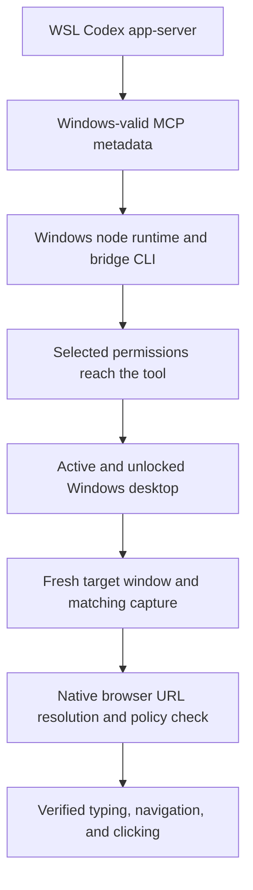

# Native Computer Use with a WSL agent: investigation

Updated: 2026-10-02. Status: **the installed Chrome timing helper passed the
full native new-tab/input/click test in four fresh turns, including normal native
Chrome launch and its repeat without the experimental accessibility flag**.

The goal is to operate Windows Chrome through Codex's bundled native Computer
Use API from an existing WSL-backed chat. The agent and repositories stay in
WSL. Completion requires verified typing, navigation, and mouse clicking in
that affected chat, followed by a successful test in another fresh turn.

## What the evidence currently establishes

The investigation has encountered several independent failures. Repairing an
earlier stage allows the next stage to run; it does not prove the later stage
works.



The URI and Windows-child launch repairs have cleared startup failures. Reloading
MCP connections cleared stale permissions in the affected chat. Chrome keyboard
and mouse navigation passed in the troubleshooting chat on October 1. An earlier
affected-chat attempt opened a tab and typed, but navigation ended with the
native URL-confidence stop; that attempt did not verify page load or mouse control.

On October 2, a later native inventory exposed no targetable Chrome window.
The supported native launch restored one New Tab window. A fresh read-only
baseline then returned from `get_window` but failed in `get_window_state` with
the same URL-confidence stop, before any keyboard or mouse input. This pins
down that attempt's failing API.

The user then loaded Example Domain and put Chrome in the foreground. A native
read-only baseline succeeded. **Two subsequent fresh-turn tests in the existing
affected chat each verified typing, committed navigation, and mouse clicking.**
The typed URLs were `https://example.com/?codex_wsl_cua=1` and
`https://example.com/?codex_wsl_cua=2`; each loaded the expected document and its
visible Learn more link led to `https://www.iana.org/help/example-domains`.
The second test started on IANA, establishing cross-origin navigation as well.
Screenshot, accessibility text, and document URL agreed; neither test returned
a native error. This satisfies the two fresh-turn input acceptance tests.

A separate controlled test then explicitly activated Chrome and confirmed a
matching IANA baseline. `Ctrl+T` returned successfully, but its immediate
`get_window_state` produced the URL-confidence stop. No typing or navigation
from the New Tab was attempted. **Foreground activation alone did not repair
this failure.** The two successful loaded-page tests do not establish a universal
URL-resolver repair.

A later fresh-turn observation of the existing New Tab succeeded with matching
screenshot/accessibility and native document URL `chrome://new-tab-page/`.
Another fresh turn then completed typing `https://example.com/?codex_wsl_cua=3`,
committed navigation, and the Learn more click to IANA with no native error.
**Three complete native input tests have now passed in the affected chat.**

A controlled comparison then focused the address bar on IANA, typed
`https://example.com/?codex_wsl_cua=4`, and used Chrome's `Alt+Enter` shortcut.
Typing and the key action returned, but the immediate `get_window_state` again
produced the URL-confidence stop. No observation or input followed; new-tab
creation, committed navigation, and the link destination were not verified.

These observations distinguish successful use of a previously opened New Tab
from unsuccessful immediate state reads after tab-creation actions. A
transition or accessibility-initialization issue is a hypothesis, not a proven
internal cause. The latter failure remains the reliability gap.

The human authorized the reviewed diagnostic launch. Its guard first refused
because Chrome processes remained. After Chrome fully exited, the launch
succeeded and the real Windows main process contained
`--force-renderer-accessibility=complete`. The first native test found no window
because the human had closed Chrome again; this did not test the flag.

After an authorized relaunch, the affected chat verified an initial capture of
`chrome://whats-new/`, `Ctrl+T` followed immediately by a successful state read
of `chrome://new-tab-page/`, typing `https://example.com/?codex_wsl_cua=5`, and
committed navigation with matching Example Domain content. Computer Use then
stopped during `LEARN_MORE_CLICK` with **“Computer Use was stopped by the user
with the physical Escape key.”** No further Computer Use occurred in that turn.
The IANA destination was not verified. This is the first passing immediate
New Tab capture under the candidate startup flag, but a complete flow and a
fresh-turn repeat are still needed. It does not establish that the flag caused
the improvement. Checkpoints 31 and 32 record the launch and partial native test.

The human confirmed the Escape interruption was intentional and explicitly
authorized resumption. Before the fresh test, the same real Chrome main process
was checked again and still had the complete-mode flag. Native discovery,
activation, and a matching Example Domain baseline passed. `Ctrl+T` returned,
but `NEW_TAB_IMMEDIATE_GET_WINDOW_STATE` produced the original URL-confidence
stop. Typing the sixth URL, committed navigation, and clicking were not
attempted, and all Computer Use stopped immediately. **The complete-mode flag
has not produced a reliable fix in this configuration.** Checkpoint 33 records
the failed repeat; the launcher has not been promoted to a public fix script.

### Capture timing experiment and deployment

The next diagnostic changed when the **first** state request occurred after
Ctrl+T. It did not retry a failed request. From a verified loaded HTTPS baseline,
two fresh turns each waited 2,000 ms after the successful key action and before
the first native capture. Both returned `chrome://new-tab-page/`, verified typed
and committed Example Domain URLs, and clicked Learn more to IANA without a
native error. The first action/wait/capture sequence took 2,221 ms; its repeat
took 2,230 ms. These passes retained the complete-accessibility launch flag, so
they established a timing candidate, not yet independence from that flag.

The reviewed Windows JavaScript backend had no visible settling step comparable
to the Linux client's action settler. This does not establish what the native
binary does internally. A reversible first deployment wrapped that backend
module, but the live RPC session still captured in 129 ms and stopped at URL
verification. That edit was rolled back exactly; its original SHA-256 is
`617d8e6e18fdde25f06d4cba2c84c994e076e05f30a8c55d09e918401c48b171`.
No further Computer Use occurred in the failed turn.

The corrected deployment hooks the **imported Sky entry facade** on its Windows
target, which is the active RPC boundary in this session. It only delays Chrome
capture after a successful native input or activation, calls the original
method once with the original request, and returns its state or error unchanged.
The native backend and URL policy are retained. The installer is guarded by
the reviewed Sky 0.7.5 facade hash and can restore the original bytes.

Resetting the idle JavaScript kernel before importing Sky activated the new
facade; an MCP reload alone had not refreshed the module. Static inspection
confirmed the active wrapper before any browser calls. In the affected chat,
ordinary Sky calls then verified the loaded query13 baseline, immediate Ctrl+T
capture of `chrome://new-tab-page/`, typing and committed query14 navigation,
and the Learn more destination `https://www.iana.org/help/example-domains`.
Screenshot, accessibility text, and native document URL agreed throughout.
Ctrl+T took 80 ms, the gap before capture was 0 ms, and capture took 2,162 ms.
There was no manual wait or native error. Checkpoint 37 records this first
complete deployed pass. The fresh-turn repeat also passed without a kernel
reset: query15 baseline, immediate valid New Tab, committed query16, and the IANA
click. Ctrl+T took 81 ms, the capture call began immediately and took 2,135 ms,
and there were no native errors or manual waits. Checkpoint 38 records both
consecutive passes.

The human's earlier explicit permission to terminate and relaunch Chrome was
then used to exit the flagged process. Its identity was checked before stopping
only Chrome processes in its Windows session; zero remaining processes were
verified. In a fresh turn, ordinary native `launch_app` with the returned Chrome
app ID succeeded in 1,005 ms, with no extra flags. Read-only Windows process
metadata confirmed the new main process had no forced accessibility flag.
Initial capture returned `chrome://new-tab-page/`. The full query17/query18 and
IANA click flow passed with matching screenshot/text/URL and no native error.
Ctrl+T took 81 ms, its immediate capture took 2,182 ms, and no manual wait or
kernel reset was used. The normal default-browser prompt was dismissed with
Set later; Restore pages was left available. Checkpoint 39 records the first
standalone normal-launch pass. The final fresh-turn repeat also passed: loaded
query19 baseline, immediate valid New Tab, committed query20, and IANA click.
Ctrl+T took 80 ms, capture began with a zero-millisecond gap and took 2,184 ms,
and screenshot/text/URL agreed. No manual timer, kernel reset, or native error
occurred. The same normal Chrome main process was rechecked after the repeat;
it still had no forced accessibility flag. Checkpoint 40 records two consecutive
complete flows on normally launched Chrome. The installed helper therefore
has four complete deployed passes, two independent of the startup experiment.

| Installed helper test | Startup configuration | First capture after Ctrl+T | Complete flow |
| --- | --- | --- | --- |
| Query13/query14 | Experimental complete-accessibility flag | 2,162 ms | New Tab, typing, committed Example Domain, IANA click passed |
| Query15/query16 repeat | Same flagged Chrome; no kernel reset | 2,135 ms | All stages passed |
| Query17/query18 | Normal native launch; flag absence verified | 2,182 ms | Initial capture and all input stages passed |
| Query19/query20 repeat | Same normal Chrome; no kernel reset | 2,184 ms | All stages passed |

Every action-to-capture call gap was 0 ms; the helper supplied the settling
interval internally. Native URL policy, original requests, and error propagation
were retained. The installer and JavaScript helper tests also passed, including
exact restoration, unknown-build refusal, and unchanged native stop handling.

The previously observed native URL error is:

```text
Computer Use has been stopped for this turn because it could not determine
the current browser URL on Windows with enough confidence to enforce policy.
Stop your work and send a final message noting why Computer Use ended.
```

That error reports unsuccessful URL verification. It does not identify which
internal stage failed or establish that the intended public site was denied.

## Issues and attempts recorded so far

The numbered evidence references below identify local diagnostic checkpoints.
They distinguish live native-tool results from isolated probes, unit tests, and
untested proposals. Private logs and configuration are not published here.

| Issue | What we tried | Observed result | Current conclusion / evidence |
| --- | --- | --- | --- |
| Project creation sends Windows/UNC roots to the WSL app-server | Separate project-root JSONL proxy | Existing project-path workaround published independently | Keep separate from Computer Use; see the main README |
| Windows `node_repl` rejects `file:///home/...` before JavaScript runs | Compare original URI with the same directory represented through WSL UNC | Original rejected; translated URI executed the isolated test | URI mismatch confirmed; checkpoints 1–3 |
| Initial adapter handled mounted Windows drives but missed Linux-native WSL directories | Add `wslpath` mapping and reverse directory-identity validation | Both drive and WSL mappings passed checks; native app enumeration subsequently worked | Startup repair works; checkpoints 2–5 |
| Windows bridge inherited the Linux project-proxy script as `CODEX_CLI_PATH` | Give only the Windows child a copied, verified Windows CLI; retain the WSL agent | Cleared the Windows-executable launch problem | Child launch repair retained; checkpoints 5–8, 13 |
| Shared Desktop native helper route remains incompatible with the global WSL selector | Use the bundled SDK's per-runtime fallback with `SKY_CUA_NATIVE_PIPE=0` | Native API calls and later Chrome input worked through that route | Native `@oai/sky` API is retained, but the Desktop shared connection has not been restored; checkpoint 13 |
| Windows child CLI differed from the installed package | Align the child with bundled CLI 0.159.0 and required native companions | Fresh configured probe imported Sky and enumerated apps | Version repair cleared startup; did not establish a URL-check repair; checkpoint 8 |
| An old adapter process kept serving calls after source changes | Identify the serving adapter, retire the old process, reload MCP connections; later add request-time loading | Actual tool received the URI translation | JavaScript reset alone does not replace the MCP launch; checkpoints 10, 12 |
| A standalone probe could not display app approval | Test import/enumeration without granting app consent; use the real chat tool for subsequent actions | Probe reached approval but lacked its UI | Standalone discovery is not a browser-control acceptance test; checkpoint 5 |
| Managed permissions still contained Linux filesystem paths | Translate permission paths to the same Windows-accessible objects in an isolated experiment | Windows path parsing advanced, then ACL setup failed on WSL UNC roots | Restricted WSL support remains unresolved; experimental changes rolled back; checkpoints 9–10 |
| Windows ACL enforcement failed on the WSL workspace | Test the existing elevated backend and repair missing bundled sandbox companions | `GetSecurityInfo` error 1 on UNC workspace roots | Simple path translation cannot repair this managed-profile failure; checkpoint 9 |
| The user selected Full Access, but the native tool still received a managed profile | Reset JavaScript, compare turn metadata with adapter audit, send supported `config/mcpServer/reload` | Reset failed to refresh permissions; MCP reload delivered `disabled` and restored enumeration | Confirmed stale-connection failure; checkpoints 16, 21–23 |
| Disconnected or locked Windows session blocked capture/input | Query Windows session/process metadata; reconnect and retest; later use the physical desktop | `GetCursorPos` access denied and monitor-capture errors correlated with inactive/locked sessions | An active desktop is necessary; physical-desktop Chrome test later passed; checkpoints 11, 18–20 |
| Remote access appeared usable while the helper's session changed state | Compare target process session, lock state, and live browser marker; bounded wait for active session | A session briefly active/unlocked later became disconnected/locked | Remote UI access alone did not establish a continuously usable helper desktop; checkpoint 19 |
| A possible accidental cancellation interrupted a test | Honor the stop, then perform a user-authorized fresh retry after checking session state | Session remained disconnected during the bounded wait | No successful input claim from that retry; checkpoint 19 |
| Chrome accessibility described Chrome while the screenshot showed Codex | Explicitly activate the returned Chrome window and reacquire screenshot/text | Capture then matched Chrome; subsequent root-chat input succeeded | Confirmed capture/focus discrepancy; its cause in the affected chat is still unproven; checkpoint 20 |
| Brave captures worked but later browser input hit URL-confidence enforcement | Native enumeration, activation, fresh capture, keyboard/click tests | Some early capture/click success; later input stopped | Reliable Brave control remains unverified; Chrome is the user's selected browser; checkpoints 6, 17, 20 |
| Full Codex restart did not produce a complete browser repair | User fully quit and reopened the application; inspect actual post-restart state | Discovery worked; inactive desktop and URL-confidence failures remained | Restart was not a verified universal fix; checkpoints 17–19 |
| Browser settings displayed an organization/region availability message | Read actual availability logs and the installed frontend decision | Local `reason=wsl-disabled` and corresponding WSL checks found | This was a Browser Use availability decision, not proof of an organization/region restriction; checkpoint 15 |
| Browser extension / Chrome developer integration might solve it | Inspect installed extension metadata and native/browser availability | Chrome extension was present; the WSL availability gate remained | Extension installation does not remove that gate; no proven native URL repair; checkpoints 14–15 |
| Different chats appeared to have different browser capabilities | Compare actual turn and MCP permission metadata; serialize native browser tests | Managed-vs-disabled and stale permissions explained startup differences | Shared foreground can interfere with input, but it was not the demonstrated cause of the path-parser failure; checkpoints 21–23 |
| Chrome worked in one chat but remained unreliable in the affected chat | In a fresh target-chat turn, select/activate Chrome, open a new tab, type a public URL, then press Enter and refresh | New tab and typing verified; navigation step stopped; click test never ran | Earlier incomplete acceptance attempt; checkpoint 23; subsequent loaded-page tests passed at checkpoints 27–28 |
| New-tab input/refresh returned an uncertain outcome | Reacquire a fresh window/state before another action | Confirmed the tab had opened | The wrapper did not preserve the original cause, so the specific initial failure remains unknown; checkpoint 23 |
| Need a reusable permissions refresh | Add `refresh-computer-use.py` with a dry run and process/pipe identity checks | 46 repository tests passed; real dry run and reload request succeeded; published in `bd9eb79` | Repairs stale MCP connections, not the native URL resolver; checkpoint 23 |
| Native inventory later reported no targetable Chrome window | Compare native discovery with Windows process/session metadata, then use the documented native `launch_app` recovery | Chrome had a Windows main window, but native inventory returned zero; one native launch returned one Chrome New Tab window | Target visibility restored for this attempt; its previous absence remains unexplained; checkpoint 26 |
| Fresh New Tab observation failed before any browser input | Fresh selection, separate `get_window` and `get_window_state` phase markers, one native observation | `get_window` returned; `get_window_state` produced the original URL-confidence turn-stop; no state or input followed | Pre-input state-read failure for New Tab; later loaded HTTPS baseline succeeded; checkpoints 26–27 |
| Need complete input acceptance in the affected chat | User prepares loaded Example Domain; select and explicitly activate a fresh native Chrome window; type, commit, observe, click, observe | Both query-bearing documents and both Learn more destinations verified in two fresh turns; no native errors | Loaded-page control verified in the existing WSL-backed chat; checkpoints 27–28 |
| Does foreground activation alone fix New Tab? | Start from matching IANA screenshot/text/URL after explicit activation; one `Ctrl+T` followed immediately by native state refresh | Key action returned; `get_window_state` failed with the original URL-confidence stop; no further input | New Tab startup unresolved; foreground alone insufficient for this controlled attempt; checkpoint 28 |
| Is a previously opened New Tab permanently unreadable? | One fresh read-only selection/activation/state observation, followed by a complete input test in another turn | Native `chrome://new-tab-page/` state read passed; typing, committed Example Domain navigation and IANA click all passed without native errors | Existing New Tab was usable; immediate creation refresh was still unresolved at checkpoint 29, before the later timing helper |
| Does opening a public URL directly in a new tab avoid the failing refresh? | From a verified IANA baseline, type the harmless fourth test URL and use native `Alt+Enter`, then immediately observe | Typing and key action returned; refresh failed with the original URL-confidence stop; tab creation and navigation were not verified | The immediate-refresh failure extends beyond blank `Ctrl+T`; no input or state read followed; checkpoint 30 |
| Could Chrome accessibility initialization affect the first observation? | Launch the reviewed default-dry-run script after Chrome exits, verify its real startup flag, then use native Sky in the affected chat and repeat after explicit human resumption | First initial capture, immediate Ctrl+T capture, typing, and navigation passed; physical Escape interrupted click. Fresh-turn repeat still stopped immediately after Ctrl+T with the original URL-confidence error | Complete accessibility is insufficient for reliable tab creation in this configuration; not promoted as a public fix; checkpoints 31-33 |
| Does settling before the first native capture affect the transition? | After a successful Ctrl+T from a verified loaded HTTPS page, wait 2,000 ms before the first capture; preserve normal native policy | Two fresh-turn tests completed valid New Tab capture, typing, committed navigation, and IANA clicking without a native error | Timing candidate reproduced; complete-accessibility flag still present; checkpoints 34-35 |
| Does wrapping the Windows backend module affect the live client? | Version-guarded reversible deployment, then immediate native capture without a manual wait | Capture remained 129 ms and stopped at URL confidence; no further Computer Use that turn | First deployment did not affect the live RPC path; original backend restored; checkpoint 36 |
| Can ordinary Sky calls use the settling candidate automatically? | Hook the imported Windows-target facade, reset the idle JavaScript kernel once before app calls, verify active wrapper, perform the full native flow without a manual timer; repeat without resetting | Both complete flows passed, including immediate valid New Tab; captures 2,162 ms and 2,135 ms; no manual waits or native errors | Two consecutive deployed passes verified; standalone normal-launch test also passed later; checkpoints 37-39 |
| Does the timing helper depend on the complete-accessibility flag? | Authorized identity-checked Chrome termination, documented native launch without flags, real-process flag checks before/after testing, complete flow and fresh-turn repeat | Normal launch and both complete query17/query18 and query19/query20 flows passed; immediate New Tab captures 2,182 ms and 2,184 ms | Two consecutive standalone passes verified; checkpoints 39-40 |

## Proposals not adopted as fixes

| Proposal | Status and reason |
| --- | --- |
| Move the agent to Windows | Excluded by the user's requirement; WSL remains selected |
| Remove permission metadata or fabricate Full Access | Not implemented; repairs preserve the actual selected profile |
| Restrict the Windows child to a projected temporary workspace | A draft was saved but never installed; abandoned after the user selected Full Access; no effectiveness claim |
| Replace native Computer Use with CDP, Playwright, or another MCP browser | Not implemented as a repair of the requested native mechanism |
| Apply older binary offsets from a community patch | Not implemented; current artifact compatibility and a safe source-level repair have not been established |
| Force complete Chrome accessibility at startup | Real flag verified and first immediate New Tab capture/navigation passed, but the fresh-turn repeat failed at native URL confidence; not a reliable fix and not promoted to a public fix script |

The previously proposed loaded-public-page baseline has now been tested. It
enabled two complete native input tests in the affected chat, but does not
repair the separately observed New Tab state-read failure.

## Community research ledger

Read primary author reports and code, rather than treating search snippets or a
utility's static health check as proof. Dates below are source dates or the
latest checked update, not a promise that the workaround works on this machine.

| Source | Finding | How it changes this investigation |
| --- | --- | --- |
| [Manuel Parra's WSL URI patch](https://th3nolo.com/articles/codex-computer-use-wsl-sandboxcwd) | Maps tool-call cwd metadata for Windows, uses a Windows-native child CLI, and separates Chrome connection recovery | Independently supports the startup boundaries already repaired here; not a demonstrated fix for our remaining native URL error |
| [Upstream native URL issue #25271](https://github.com/openai/codex/issues/25271) — open; updated September 27 | Reproductions persist across browser generations; later comments separate extension recovery from native window failure | Investigate the Windows native URL path independently of WSL startup |
| [UIA document/focus investigation, August 29](https://github.com/openai/codex/issues/25271#issuecomment-5459908436) | Proposes stable numeric Document identity and corrected focus/refresh behavior; verified by its author on an older build | Concrete hypothesis, not a portable patch; compare local language, capture, and post-action behavior first |
| [English-label counterexample, September 10](https://github.com/openai/codex/issues/25271#issuecomment-5618209961) | Reports native failure despite English Document labels | Do not assume changing browser/system language solves every URL failure |
| [WinBridge Recovery](https://github.com/zemeng5208/winbridge-recovery) — main commit August 23; rechecked October 2 | Checks and repairs plugin/cache/runtime/registration drift; maintainer distinguishes URL enforcement from local consistency | Borrow its diagnostic boundaries; installing it is not evidence of a URL-resolution fix |
| [Windows Fast Patch context script](https://github.com/chen0416ccc-cpu/codex-windows-fast-patch-skill/blob/main/scripts/patch-computer-use-node-repl-context.ps1) — repository updated September 30 | A hash/version-specific SDK request-context patch for Sky 0.6.2 | Compare the actual installed SDK before considering it; its documented symptom differs from our final native stop |
| [Cross-call context report](https://gist.github.com/MSWEIMZ/0b8368f34a20c7ab6a89d53afebde14c) — August 7 | Reports `node_repl exec context not found` and same-call recovery in native Windows | Distinct error family; do not adopt an action batch that skips the current skill's observation requirements |
| [Rotated native-pipe repair #41453](https://github.com/openai/codex/issues/41453) — updated September 5 | Author describes refreshing an obsolete product-generated pipe identifier once after `FILE_NOT_FOUND` | Relevant to shared-connection lifecycle; our current per-runtime route is different and our final error is not missing-pipe |
| [Current Chrome/Edge reproduction #46943](https://github.com/openai/codex/issues/46943#issuecomment-5869800007) — September 28 | Native URL verification still fails after extension diagnostics pass; a separate non-browser capture timeout is also reported | Browser integration health does not prove native URL verification; do not assume the capture timeout explains our successful captures |
| [Current Edge reproduction #31221](https://github.com/openai/codex/issues/31221#issuecomment-5872343234) — September 28 | Sky 0.7.4 still fails after removing an obsolete CLI override, despite independently readable URL sources | Correct CLI selection is necessary but not sufficient; this newer generation has no verified native recovery in the report |
| [Chrome window/tab association report #42766](https://github.com/openai/codex/issues/42766) — September 4 | Native Chrome state fails while the separate connector can list tabs | Window association is a hypothesis; the reporter's interpretation is not a maintainer-confirmed diagnosis |
| [Same-SDK current-build report #45996](https://github.com/openai/codex/issues/45996#issuecomment-5948262149) — October 2 | Native Edge URL determination still fails on Sky 0.7.5 and package 26.930.2377.0 after the separate browser integration works | A newer release is not a demonstrated universal fix; the report uses Chinese UI, so it does not establish our English-UI cause |
| [Recent Chrome report #40474](https://github.com/openai/codex/issues/40474#issuecomment-5927363911) — October 1 | Native Chrome state fails on bundle 26.928.31416, including in a fresh chat, while Browser Use succeeds | A problem confined to one chat cannot explain every reproduction; our affected chat now passes loaded-page tests, so New Tab state is the remaining local comparison |
| [Isolated Windows runtime home #27463](https://github.com/openai/codex/issues/27463) — June 10 | Author reports desktop-app control after separating Windows helper files from the shared WSL home | Its acceptance examples do not establish Chrome navigation; our current shared helper directory is empty and shell execution works, so no matching failure was demonstrated and no home change was applied |
| [Chrome New Tab state report #46200](https://github.com/openai/codex/issues/46200) — September 17 | Native Chrome enumeration succeeds but a read-only New Tab state request terminates with the URL-confidence error | Closely matches our failing API and page class; no compatible repair is established by the report; its locale and versions differ |
| [Overlapping address-field report #34715](https://github.com/openai/codex/issues/34715) — July 22 | An Opera reporter finds an empty outer address element overlapping an inner element with a valid URL and proposes examining all candidates | A specific extraction hypothesis, not a demonstrated cause for our Chrome New Tab failure; no matching local observation or portable patch was established |
| [Chromium accessibility overview](https://chromium.googlesource.com/chromium/src.git/+/HEAD/docs/accessibility/overview.md) | Accessibility normally enables on demand; an explicit `--force-renderer-accessibility=complete` keeps the full mode enabled | Supports a controlled initialization experiment; does not establish that it fixes Codex's URL resolver |
| [Chrome keyboard shortcuts](https://support.google.com/chrome/answer/157179) | Documents address-bar `Alt+Enter` for opening a new tab | Provided a normal native-input comparison; our immediate refresh still failed after that action |

### Local applicability checks on October 2

- Both running adapters identify the same configured Windows node runtime and
  **Sky 0.7.5**. Their helper-transport module hashes agree.
- Both serving adapters were started after the installed adapter and child-CLI
  settings were last modified. Stale launch settings are therefore a weaker
  explanation for this comparison. The ordinary JavaScript environment exposes
  neither child environment values nor `process.env`, so that probe did not
  establish the live trusted service's environment; absent exposed values are
  not evidence that the child settings are missing.
- The community request-context patch requires **Sky 0.6.2** and a different
  exact module hash. It is not applicable to these artifacts; that request-context
  patch was not applied. The later timing helper changes the separately reviewed
  Sky 0.7.5 entry facade only.
- Windows UI culture, installed UI culture, and ordinary culture report
  **en-US**. There is no user `ComSpec` override and the process value points to
  the standard Windows command interpreter. Those proposed explanations are
  deprioritized; these checks alone do not prove live Document selection.
- The copied Windows child CLI exists and matches its configured SHA-256 and
  installed-package provenance. WSL remains enabled in the Desktop config.
- Chrome, Desktop, and the Windows node runtimes share the active console
  session. This query establishes an active session, not continuous foreground
  ownership or unlocked status throughout a future test.
- The generated launch still advertises a shared pipe, while our child adapter
  selects the previously documented per-runtime route. A shared-pipe rotation
  patch is therefore not a direct repair for the current fallback URL failure.
- During the later zero-window audit, the actual affected-chat MCP requests
  still carried the user's disabled permission profile. The Windows input
  desktop was accessible `Default`, with no LogonUI process. The old
  managed-profile parser failure and externally inaccessible-desktop symptom
  were not reproduced; the native worker's complete effective context and the
  reason its inventory omitted a window remain unverified.
- A subsequent inventory in the affected chat returned exactly one Chrome
  window classified as New Tab. A fresh native state observation then succeeded;
  the earlier failure is not a demonstrated permanent New Tab restriction.
- The complete-mode launcher defaults to a dry run and refuses to launch while
  Chrome processes remain. An authorized apply succeeded, and the real Chrome
  main process contained `--force-renderer-accessibility=complete`. Initial
  capture, immediate New Tab capture, typing, and committed navigation then
  passed; the click was stopped by physical Escape. After explicit resumption,
  the same flagged process passed its loaded-page baseline but failed the
  immediate Ctrl+T capture again. No profile, registry, native policy, or engine
  setting changed.
- Upstream issue #25271 still has 44 comments and is open; #46200 is also open.
  The reviewed Fast Patch and WinBridge repository heads are unchanged since
  the previous review. No newly compatible implementation was found in those
  refreshed sources.

### Current research conclusion

The sources support separating WSL startup repair, runtime/request-context
repair, desktop capture, and native URL verification. Local acceptance
establishes a working native Chrome flow from loaded public pages in the
affected chat. The checked reports do not provide a portable, verified native
post-tab-creation URL fix for our current artifacts. A locally developed,
hash-guarded Sky facade timing helper now has four complete deployed passes with
immediate captures. These include a complete normal native cold-launch pass and
its fresh-turn repeat, with the real Chrome startup flag verified absent.
Older source-level hypotheses are useful for designing the next observation;
their binary offsets and version-pinned replacements are not compatible fixes.
This is an investigation result, not a claim that every remaining cause has
been ruled out or that the failure is proven to be an upstream defect.

Confidence is **high** for the observed complete native flows and **medium-high**
for the local timing workaround: the first capture after tab creation now
passes repeatedly without any manual timer, including after a normal launch.
Confidence is **low** in any specific internal explanation: the supported API
reports the URL-confidence stop but does not expose extraction, window
association, or validation internals. These public-page tests do not establish
every website, browser, desktop session, or future runtime build.
The startup flag had **medium-low** confidence before testing. One immediate
New Tab capture and navigation passed, but its fresh-turn repeat failed with
the original URL-confidence stop while the real flag remained present.
Confidence is **high** that the flag alone was insufficient in this tested
configuration; the internal cause remains unverified. A prior community
reproduction also tried a renderer-accessibility flag without resolving its
native URL error.

## Experiments and acceptance rules

| Experiment | Evidence to collect | Decision rule | Confidence before test |
| --- | --- | --- | --- |
| Read-only runtime consistency audit | Actual adapter parent, active runtime, Sky version, native CLI selection, plugin generation, metadata shape | Repair only a demonstrated mismatch; keep the already working layers stable | High for identifying drift; low for proving it causes the URL stop |
| Check Windows UI language and native Document output | Read-only culture metadata and a supported native state observation on a loaded public page | If labels are English, deprioritize the language-only theory; do not change system language speculatively | Medium |
| Distinguish action failure from immediate-refresh failure | Record which supported API call returned or failed, while retaining the original error | A native stop ends input for that turn; no blind action retry | High diagnostic value |
| Compare a stable loaded page with a new-tab transition | Fresh native state, matching screenshot/text, explicit activation, one allowed action and refresh | Completed: loaded-page flows passed; explicitly activated New Tab state refresh failed; internal failing stage remains unknown | Medium before test; high for the observed difference |
| Recheck the affected chat in another fresh turn | Actual MCP profile, selected returned window, screenshot/focus, native typing, committed URL, clicked destination | Completed: original loaded-page tests and later deployed timing repeats passed; native New Tab is now verified with the timing helper | High for verification |
| Find a compatible New Tab repair | Primary source implementation or supported diagnostic that matches the current Sky/native build and retains URL verification | Local hash-guarded Sky 0.7.5 facade timing helper is implemented and live-tested; native policy and error handling retained | Low before the matching timing diagnostic; medium-high for the tested local workaround |
| Compare direct-URL and blank-tab creation | Native input from a verified public baseline, one tab-creation action, immediate state read | Completed: `Alt+Enter` also stopped at refresh; new-tab creation/navigation unverified after stop | Medium before test; high for the observed failing phase |
| Pre-enable complete Chrome accessibility | Authorized launcher apply, verified real flag, native initial capture, immediate Ctrl+T capture, typing, committed navigation, then a fresh-turn repeat after human resumption | Completed: first capture/navigation stages passed, click interrupted; fresh-turn repeat stopped immediately after Ctrl+T. Keep the launcher as a diagnostic, not a verified fix | Medium-low before test; high that this was insufficient in the tested configuration |
| Settle before the first capture | One changed variable: wait after successful tab-creation input and before the first state request, with native URL checking unchanged | Completed: two full fresh-turn diagnostic flows passed; no failed capture was retried | Medium before test; high for the observed result |
| Deploy the timing helper at the live API boundary | Hash-guarded facade edit, one idle kernel reset before import, static active-wrapper proof, immediate ordinary API captures | Completed: four full fresh-turn tests passed with no manual waits; two used normal Chrome without the experimental flag | Medium-high for the local workaround |
| Remove the experimental flag | Authorized normal native Chrome launch, real main-process flag absence, initial capture, full flow, then a fresh-turn repeat | Completed: normal native launch and two consecutive standalone flows passed; real flag absence verified again after the repeat | Medium-high before test; high for the observed passes |

Continue recording a source, its applicability, the single changed variable,
the exact observed result, and what the result rules out for every experiment.
Do not reinstall everything, repeat restarts, widen permissions, or modify URL
policy on the basis of an untested theory.

Windows foreground and app-approval behavior are described in the official
[Computer Use documentation](https://learn.chatgpt.com/docs/computer-use).
